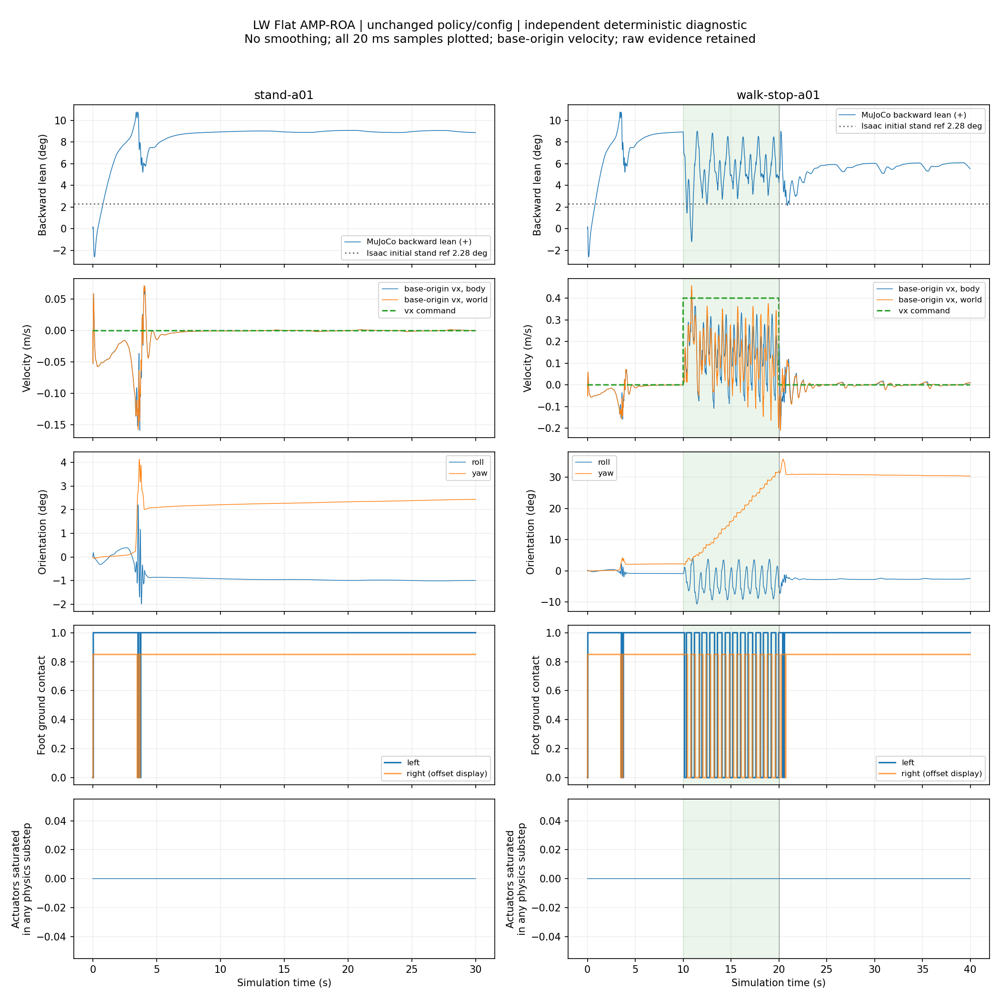

本次在保持当前 ONNX、配置和物理参数的条件下，完成了 A（30 秒）和 B（40 秒）的各一次诊断采集。纯站立 5–10 秒平均后仰 **8.6545°**，10–30 秒 **8.9693°**；直行停止后 22–30 秒 **5.5880°**，30–40 秒 **5.8157°**。无中途 reset、跌倒、非有限值或运行核心安全终止。证据支持本次条件下存在持续后仰，不能据此确定单一根因。

**运行范围与适用边界。** 本次使用新增的独立 C++ 诊断程序，直接编译并调用当前仓库的 `LWRuntimeCore`、`ObservationBuffer`、`RL::ComputeLWObservationInto/ComputeLWOutput`、腿式 FSM 和 `LWMuJoCoControlAdapter`，仅用透传模型包装器复制输入/原始输出。未修改 `/home/lfr/rl_sar` 中的代码、配置或策略。它采用确定的仿真时间事件顺序，**不是原 `rl_sim_LW` 交互进程的在线采集**，不能覆盖原程序的异步线程时序、交互输入故障锁存和实时调度问题。

每例新建进程，执行当前程序 R 键使用的 `mj_resetDataKeyframe(home_leg)` 和 `mj_forward`，再通过现有腿式 FSM Enter 激活策略。未更改初始姿态，未添加稳定等待；没有运行交互式 Passive → GetUp 的操作/插值过程。首个时刻尚无策略输出，原始初始命令的 Kp/Kd/ctrl 为零；第一个新动作在 t=0.006 s 的 PD 回调开始应用。这是必须保留的启动条件差别。两例 t<10 s 的原始遥测状态和动作一致，B 只在 t=10 s 后改变命令。

**策略身份。** 实际加载路径为 `/home/lfr/rl_sar/policy/LW/robot_lab/leg_loco/policy.onnx`，类型 ONNX。运行时查询输入 `obs`, float32 `[1,410]`；输出 `actions`, float32 `[1,10]`。接口没有显式 recurrent state/reset mask。内部 `[current_obs, code_vel, hist_latent]` 不是外部输入布局。

- 实际 ONNX SHA-256：`63ef20be03cbba9602d7008e84f605e62ff38cbe9ed64ce25366fdab9d08a1a7`，与用户目标及归档 ONNX 均匹配。
- 归档 JIT `/home/lfr/policy_storage/LW/leg_loco/2026-09-04-11-16-35/policy.pt`：`277285f9b728d17c3beb79dfc2d1b0ccadb7ea6a6c6f99edd79a60e3547cd87d`，匹配；本次未用 JIT 控制。
- 训练 checkpoint 原文件不在所记录的本机路径，**独立哈希复核为 unknown**。归档声明 `model_50000.pt` 的 SHA-256 为 `59ab5245acb17de8ea1b79e924c2f0189765be3c51c85f437b22b8e2423b0e19`。任务 `RobotLab-Isaac-Velocity-Flat-LW-leg-Amp-Roa-v0`、run `2026-09-04_11-16-35`、runner `OnPolicyRunnerAmpROA` 来自所保留的归档清单；没有伪称本机重新加载 checkpoint 验证来源链。

**启动和版本。** 仓库 HEAD `93d6c33fa0b8b64a5f5ab75d7c4baac3590352ea`。开始前已有 `policy/LW/robot_lab/leg_loco/policy.onnx` 未提交修改；`.agents/skills/inspect-context-compactions/` 与 `library/` 未跟踪，全部保留。变化摘要、启动前 diff、源文件/资源清单见 [baseline.json](baseline.json)。原程序二进制只记录哈希，未运行。实际物理 MuJoCo **3.2.7**，ONNX Runtime **1.22.0**，CPU 推理、intra-op=1、ORT_ENABLE_EXTENDED。编译命令在 [tools/build_command.json](tools/build_command.json)，使用已有系统编译器和依赖，没有安装依赖。完整执行命令如下（工作目录 `/home/lfr/rl_sar`）：

```bash
/home/lfr/sim2sim_test/sim2sim_diagnostics/20260910-111515/tools/collect /home/lfr/rl_sar/src/rl_sar_zoo/LW_description/mjcf/scene.xml stand-a01 /home/lfr/sim2sim_test/sim2sim_diagnostics/20260910-111515/cases/stand-a01 > /home/lfr/sim2sim_test/sim2sim_diagnostics/20260910-111515/cases/stand-a01/console.log 2>&1
/home/lfr/sim2sim_test/sim2sim_diagnostics/20260910-111515/tools/collect /home/lfr/rl_sar/src/rl_sar_zoo/LW_description/mjcf/scene.xml walk-stop-a01 /home/lfr/sim2sim_test/sim2sim_diagnostics/20260910-111515/cases/walk-stop-a01 > /home/lfr/sim2sim_test/sim2sim_diagnostics/20260910-111515/cases/walk-stop-a01/console.log 2>&1
```

输出根目录：`/home/lfr/sim2sim_test/sim2sim_diagnostics/20260910-111515`。两例各执行一次，退出码均为 0。A：1500 策略步、6000 PD 回调、15000 物理步；B：2000 策略步、8000 PD 回调、20000 物理步。调用记录见 [commands.json](commands.json) 和每例 `process.json`/`console.log`。

**实际配置与场景。** [runtime_config.json](runtime_config.json) 汇总本次加载后的配置和信号语义；每例 `effective_config.json` 是直接从实际 mjModel 和已验证运行配置导出的值，两例内容完全相同。所有 body、geom、joint、actuator、sensor、site 的有效参数均在其中。快照包含 XML、引用的 11 个 STL 和相关控制源码；资源路径/哈希见 baseline 及 [追加依赖清单](config_snapshot/additional_dependencies.json)，动态库只保存路径/哈希，不打包环境。

|资源|SHA-256|
|---|---|
|`/home/lfr/rl_sar/policy/LW/base.yaml`|`6f9f3a4c3e16ec7c11deced011062f359650c17ac73378773cd6243e9ed1a1e8`|
|`/home/lfr/rl_sar/policy/LW/robot_lab/leg_loco/config.yaml`|`89682b817081e7aeedfcb47af7f292a5e2a18953fef4dd778f235d9bd97b3622`|
|`/home/lfr/rl_sar/src/rl_sar_zoo/LW_description/mjcf/LW.xml`|`aee18ff8549fdb6b2591be554902a81b13e1252bfc36cb331154e372e3419e6f`|
|`/home/lfr/rl_sar/src/rl_sar_zoo/LW_description/mjcf/scene.xml`|`cb879c82e32f23cac8ff5597caf39ed39032c272e84e50bcea59f0320ef707c0`|

当前 `scene.xml` 引用 `LW.xml`，不是 `LW_inertial.xml` 或 `scene_terrain.xml`。物理步长 **0.002 s**；PD 名义周期 **0.005 s**；decimation=4，策略周期 **0.02 s**，与提供的 Isaac 对照相同。每策略步 10 个物理子步，4 次 PD 回调。由于 5 ms 不是 2 ms 的整数倍，PD 在首个到期物理边界执行，实际间隔为 6/4 ms 交替；没有改物理步长来对齐。float32 运行周期分别为 `0.004999999888241291`、`0.019999999552965164`，精确值保留在配置中。同步时先执行 PD 回调（发布本次传感器输入、应用已有输出），随后推理，下一次 PD 才消费新输出。原交互程序的墙钟线程不具有这个固定排序，需另行采集验证。

重力 `[0,0,-9.81]` m/s²；风 `[0,0,0]`，无附加外力或扰动注入。源码冲击实验被注释，观测噪声和额外推理延迟宏关闭；界面控制噪声默认 0。记录到的所有 pre/post `xfrc_applied`、`qfrc_applied` 均为零。XML 中 jointactuatorfrc 的 `noise=0.01` 原样保留；未把该配置声明当成已实测的随机噪声幅度。种子使用 `std::srand(42)`，未增加随机化；原 GUI 没有独立 seed CLI，本次由诊断入口设定。

地面是水平 plane，法向 +Z、坡度 0°，摩擦三元组 `[0.8,0.005,0.0001]`；接触 cone=elliptic、impratio=100、condim=3。场景保留 x=2.3,2.7,3.1,3.5,3.9,4.3 m 的台阶，中心 z=.02 m，半长 .2 m、半宽 2 m、高度半尺寸 .05–.30 m。两例边界接触记录仅涉及 floor，没有台阶接触；B 的 base 最大 x 约 1.184 m，未到第一阶 x=2.1 m 的前缘。因此台阶存在，但本次没有台阶接触证据支持其解释站立后仰。

初始 freejoint/base 原点世界位置 `[0,0,0.70]` m，wxyz 四元数 `[1,0,0,0]`；全部 qvel 为零。XML body 的默认 z=.73 m 被正常 `home_leg` keyframe 的 z=.70 m 覆盖，实际使用后者。关节初始 q 与下表默认 q 相同；完整 MuJoCo qpos（包括自由关节）为 `[0.0, 0.0, 0.7, 1.0, 0.0, 0.0, 0.0, 0.0, -0.4363, -2.234, 0.0, -0.4712, 0.0, 0.4363, 2.234, 0.0, 0.4712]`。

**坐标与姿态。** 姿态测量 body 为 `base_link`；IMU site 与它的位置/姿态变换为零平移和单位四元数。freejoint 的原始四元数为 **wxyz，body→world**。采用部署命令约定 body +X 前、+Y 左、+Z 上；没有另一个机身可视 body。源 XML 的 base STL 以单位变换附着 base_link，编译后 geom pose 中有 mesh 质心/主轴变换，已逐项保存，不能把编译后的 geom 四元数当 base 姿态。可视“前方”按该 +X 约定标注；缺少单独的网格前向标定文件。

设 `R=Rz(yaw) Ry(pitch) Rx(roll)`，原始 pitch=`asin(-R[2,0])`，roll=`atan2(R[2,1],R[2,2])`。本报告后仰正值定义为 **`backward_lean_deg = -pitch * 180/pi`**。保存原始 pitch、roll 和四元数，不用 roll 或总倾斜角代替 pitch。重力复算为 `R.T @ (g_world/||g_world||)`。

原始遥测 `pre/post.base_linear_velocity_world/body` 来自 `mj_objectVelocity(mjOBJ_BODY)`，实际是 **base_link 质心速度**。原始文件保留；[每例 telemetry_derived.jsonl.gz](cases/stand-a01/telemetry_derived.jsonl.gz) 另存明确命名的 freejoint/base 原点速度：世界系为 `qvel[0:3]`，机体系为 `R.T @ qvel[0:3]`。二者差别满足 `v_COM=v_origin+omega_world×(R@body_ipos)`，最大残差 2.22e-16 m/s。下表 vx 一律采用原点速度，避免把质心速度误作 base 原点速度。角速度明确保存世界/机体系，推理使用 IMU/site 机体系 gyro。

**质量、惯量和关节/动作。** base_link 质量 **10.802295 kg**，局部 COM `[0.08622748,-0.00009382,-0.03217461]` m。源 fullinertia `[Ixx,Iyy,Izz,Ixy,Ixz,Iyz]` 为 `[0.11709101,0.12021585,0.11536991,-0.0004895,-0.00942922,0.00018346]` kg·m²；运行时主惯量/主轴四元数及复算 tensor 见配置。其余各连杆质量/COM/惯量也已保存。10 个标量关节的有效 damping=.01、armature=.01、frictionloss=.2；freejoint 的 damping/armature 为零，**但六个自由度的有效 frictionloss 均为 0.2**（平移自由度为 N，转动自由度为 N·m）。这是运行 mjModel 导出的值：该自由关节只显式覆盖了 damping/armature/stiffness，未覆盖默认 joint frictionloss，因此继承 .2。它属于内部自由度摩擦约束，不是 xfrc_applied 外部推力。此值未修改；没有采用 XML 注释里的其他值。

|部署动作索引|关节|MJ joint id / qpos / dof|执行器索引|Kp / Kd|默认 q (rad)|scale|模式|力矩限幅 N·m|
|---:|---|---|---:|---|---:|---:|---|---:|
|0|right_hip_joint|1 / 7 / 6|0|90 / 3|0|0.25|位置 PD|±120|
|1|left_hip_joint|6 / 12 / 11|1|90 / 3|0|0.25|位置 PD|±120|
|2|right_thigh_joint|2 / 8 / 7|2|90 / 3|-0.4363|0.25|位置 PD|±120|
|3|left_thigh_joint|7 / 13 / 12|3|90 / 3|0.4363|0.25|位置 PD|±120|
|4|right_shank_joint|3 / 9 / 8|4|90 / 3|-2.234|0.25|位置 PD|±120|
|5|left_shank_joint|8 / 14 / 13|5|90 / 3|2.234|0.25|位置 PD|±120|
|6|right_foot_joint|5 / 11 / 10|6|28 / 1.4|-0.4712|0.25|位置 PD|±27|
|7|left_foot_joint|10 / 16 / 15|7|28 / 1.4|0.4712|0.25|位置 PD|±27|
|8|right_wheel_joint|4 / 10 / 9|8|0 / 0.5|0|1|速度 PD|±40|
|9|left_wheel_joint|9 / 15 / 14|9|0 / 0.5|0|1|速度 PD|±40|

全部执行器为 MuJoCo motor，gear=`[1,0,0,0,0,0]`，固定 gain=1、bias=0、无 actuator dynamics，`ctrllimited=true`，ctrlrange 与表中力矩界限一致。`forcelimited=false`，因此不存在独立启用的 actuator force clamp；不能把未启用的 forcerange `[0,0]` 解释成零力矩限制。完整关节轴/范围、执行器 gain/bias 参数在 effective config。表中数值是 float32 参数的简写，精确存储值以 JSON 为准。

动作处理为：`a=clip(raw_action,-100,100)`；非轮关节 `q_target=q_default+scale*a, dq_target=0`；轮关节 `q_target=q_default, dq_target=scale*a`。推理阶段计算的 PD torque 是估计值；FSM 实际传递的前馈 tau 为零。每个 PD tick 按传感器状态计算 `tau_candidate=tau_ff+Kp*(q_target-q_sensor)+Kd*(dq_target-dq_sensor)`，按配置 torque_limits 裁剪后写入对应 `data.ctrl[actuator_id]`；不把推理 PD 估计再叠加一次。本次原始动作最大绝对值 A=3.194812、B=3.269279，未触及动作 clip；35000 个物理子步均未达 ctrl/执行器力矩饱和。

部署策略顺序为上表，base/policy `joint_mapping=[0,1,2,3,4,5,6,7,8,9]`。MuJoCo qpos 顺序按树遍历（右腿含轮/脚，再左腿），由名称传感器适配器映射，不假定与动作数组相同。用户提供的 Isaac 遥测顺序对应部署数组索引 `[1,0,3,2,5,4,7,9,6,8]`。**这是已确认的顺序差异，但不是训练动作语义错误的独立证明**：本机缺少训练端有效 action/joint_names 配置和同状态参考张量，不能只凭遥测顺序就擅自改部署 mapping。

**观测和历史。** 每帧依次为 ang_vel(3)、projected_gravity(3)、commands(3)、q-default(10)、dq(10)、previous clipped action(10)、gait_phase(2)。角速度 rad/s×.25；重力单位向量无额外缩放；命令 m/s,m/s,rad/s×`[1,1,1]`；关节位置 rad×1（现有逻辑把轮位置观测置零），关节速度 rad/s×.05；前一步动作无额外缩放；全帧裁剪到 ±100。q/dq/previous action 按部署动作顺序。索引、单位、坐标系的机器可读表在 runtime_config.observations。

10 帧 time-major，从旧到新，history indices `[9,8,7,6,5,4,3,2,1,0]`；最新帧在 `[369:410]`。首次推理用本帧填满全部历史，此后每次推理前插入当前帧。previous action 初始为零。相位在观测前按 float32 `phase += period*1.25` 前进并模 1，零命令也更新内部相位，`||command||>0.1` 才输出 sin/cos，否则两项为零。本次未修改此逻辑；各例新进程重置策略历史，过程中未 reset。原程序单独 R 键只重置物理，代码未见同步清空该运行核心的历史；这是后续专门 reset 测试项，本次不能把不存在的中途 reset 当成后仰原因。

运行代码只有字段 scale/clip，没有运行均值方差归一化。匹配的 JIT wrapper 显示当前帧 normalizer 为 Identity，归档声明该训练归一化关闭；实际 ONNX 的 22 个节点为 Slice/Reshape/Gemm/Elu/Transpose/Conv/Flatten/Concat，已记录 [ONNX 图结构](config_snapshot/onnx_graph.json)，没有另加外部归一化。历史被直接送入导出模型，由模型内部取当前帧和编码历史。

**逐步信号与时间核验。** 每行对应一次策略推理，包含 `pre`、精确 `policy_state_float32`、完整 410 维模型输入、原始动作、`previous_action_in_observation`、新目标、全部 PD 写入及 10 个物理子步、`post`。无降采样、平滑或提前舍入；原始 float64/float32 以可往返的 JSON 数值无损 gzip 保存。派生文件以 `case_id/control_step` 关联，包含重力独立复算、原点速度、接触标记。原始文件不被派生结果覆盖。

原始积分后的 qpos/qvel 位于本步边界；原程序 `mj_step` 的 sensor 数据通常在最后一个物理子步积分前计算。本次离线用记录的物理子步回核，策略读到的 q/dq 精确对应边界前 **2 ms** 的状态，初始 reset 除外（最大误差 0）。故观测 projected_gravity 与“当前积分后姿态”的差异不能被直接判成坐标错误。用真正送入策略的 IMU 四元数复算后，最大差 A=1.93e-7、B=1.87e-7；与当前积分后姿态比较最大差约 .002568/.004392。不会把不同时刻混成同一测量。

`pre/post` 的接触和几何运动学在复制的 mjData 上 `mj_forward` 刷新，不修改原运行数据；contact force 是该边界的约束复算。`physics_substeps` 中 ctrl、actuator_force、qfrc_actuator 属于 `[from_sim_time,to_sim_time]` 的积分区间，其 post_qpos/qvel 属于区间末端。原始 `post.*last_dynamics` 也属于最后一个区间，不是对 post 状态重新求的力。每例原始日志、精确新目标与低层实际应用的策略帧号均保存。

完整输入/输出均有限；计划命令与实际观测逐样本一致；历史移位和首次填充、previous action 均精确匹配；观测关节/角速度缩放、动作目标数值误差均为 0；PD 候选力矩也用物理子步传感器状态独立回核。验证见 [validation.json](validation.json) 和 [delivery_validation.json](delivery_validation.json)。

**窗口统计：后仰正值。** 采用推理前的完整精度原始 base 姿态，窗口为左闭右开；标准差是总体标准差，P5/P95 为逐样本百分位。为归类浮点累加边界，只使用 1e-8 s 容差，不更改原始时间或数值。A 0–2 s 标明含 t=0 初始化 reset；无窗口中途 reset，未拼接 reset 前后的轨迹。表格仅显示位数作阅读用途，完整统计在 [statistics.json](statistics.json)。

|用例 / 窗口 (s)|N|均值 °|标准差 °|P5 °|P95 °|最小 °|最大 °|
|---|---:|---:|---:|---:|---:|---:|---:|
|A 0–2|100|2.9886|2.8601|-2.0258|6.8964|-2.6179|7.0932|
|A 2–5|150|7.8005|1.2542|5.8602|10.4526|5.2063|10.7634|
|A 5–10|250|8.6545|0.3011|7.9907|8.9176|7.6966|8.9279|
|A 10–30|1000|8.9693|0.0642|8.8748|9.0675|8.8675|9.0738|
|B 5–10|250|8.6545|0.3011|7.9907|8.9176|7.6966|8.9279|
|B 15–20|250|5.5801|1.3768|3.4762|8.3197|2.7534|8.5298|
|B 20–22|100|4.0503|1.6379|2.3039|8.3504|2.1200|8.9923|
|B 22–30|400|5.5880|0.4607|4.4472|6.0214|3.9841|6.0279|
|B 30–40|500|5.8157|0.2533|5.3129|6.0784|5.0977|6.0821|

**同窗口速度、roll 与接触。** 接触率指采样边界上脚 collision 与静态场景的有效约束点（efc_address≥0），未设置人为 1 N 阈值。详细双脚接触率、yaw、base 高度及速度/roll 全部分位数也在 statistics.json。

|用例 / 窗口 (s)|vx 机体系均值±标准差 (m/s)|vx 世界系均值 (m/s)|roll 均值±标准差 °|roll 最小/最大 °|左/右接触率|双脚均无接触率|
|---|---:|---:|---:|---:|---:|---:|
|A 0–2|-0.03883 ± 0.02038|-0.03909|-0.0527 ± 0.1773|-0.3095 / 0.2762|98.00% / 99.00%|1.00%|
|A 2–5|-0.03404 ± 0.04638|-0.03437|-0.2772 ± 0.6853|-1.9887 / 2.2066|97.33% / 96.67%|0.00%|
|A 5–10|-0.00270 ± 0.00293|-0.00275|-0.8840 ± 0.0186|-0.9191 / -0.8584|100.00% / 100.00%|0.00%|
|A 10–30|0.00002 ± 0.00064|0.00002|-0.9738 ± 0.0227|-1.0075 / -0.9194|100.00% / 100.00%|0.00%|
|B 5–10|-0.00270 ± 0.00293|-0.00275|-0.8840 ± 0.0186|-0.9191 / -0.8584|100.00% / 100.00%|0.00%|
|B 15–20|0.14055 ± 0.10473|0.11997|-3.1452 ± 3.9012|-9.1806 / 3.6874|58.00% / 56.00%|0.00%|
|B 20–22|-0.00217 ± 0.07996|-0.00150|-3.1048 ± 1.3378|-7.2695 / -1.2763|97.00% / 88.00%|0.00%|
|B 22–30|-0.00298 ± 0.01088|-0.00290|-2.7766 ± 0.0761|-2.8828 / -2.5525|100.00% / 100.00%|0.00%|
|B 30–40|0.00036 ± 0.00646|0.00048|-2.6838 ± 0.0882|-2.7872 / -2.4146|100.00% / 100.00%|0.00%|



**与 Isaac 参考的比较及结论分级。** 已证实：A/B 初始 5–10 s 平均后仰 8.6545°、P5/P95 7.9907°/8.9176°；数值上比用户提供的 Isaac 无推力初始站立均值 2.28° 高 **6.3745°**，本次 P5/P95 也高于该参考的 1.16°/3.43°。这是两份记录的观察差别，不能抹去采集入口、初始流程和未知训练配置的差别，把差值直接归为纯 MuJoCo 引擎偏差。

已证实：A 10–30 s 零命令下实际 vx 约为零、双脚持续接触，机身维持约 8.97° 后仰，并非仅启动瞬态。B 停止后逐步接近约 5.8°，与同一次配置下从未行走的 A 稳态不同，说明观测到的最终姿态与此前命令/运动历史有关。不能由此单独断言历史编码器故障，机械状态/接触与历史张量同时变化，尚未隔离。

已证实：B 15–20 s 机体系 vx 平均 **0.14055 m/s**，世界系 vx **0.11997 m/s**，低于指令 .4；零 yaw 指令仍发生偏航，整段 yaw 最大约 35.80°，结束约 30°。这与初始纯站立一起提示需要核对完整语义与动力学，而不能只优化 pitch。两个测试均未发生执行器饱和；本次记录不支持“持续力矩饱和导致站立后仰”的描述。原始关节/执行器力矩全部保留，可做更细的平衡分析。

配置差异推测：**freejoint 六自由度实际继承 frictionloss=.2** 是应优先与训练物理定义核对的具体配置；本次没有单独记录自由度摩擦的约束力分量，也没有隔离实验，不能确定其对后仰的因果贡献。部署顺序与所给 Isaac 遥测顺序不同，也是优先核对项；是否意味着 action/observation 错配仍 unknown。base COM 的 x 正偏移、MJCF 惯量、damping/armature/frictionloss、执行器 PD/轮控制方式及 2 ms 传感器求值时差可能影响平衡，但本机没有与该 checkpoint 完整绑定的 Isaac 有效物理/动作配置，不能宣称已确认这些参数与 Isaac 不同，更不能指定其中一个为根因。

仍需补测：在上层提供训练端真实 joint/action indexing、有效配置和同状态输入/输出样本后做开环语义核对；将本次固定输入日程接入原交互运行进程，采集真实线程时序以核验诊断入口等价性；按完全相同的 home/reset/启用流程及命令历史在 Isaac/MuJoCo 复测；单独检查活动策略下物理 reset 与历史 reset 的同步。若需修改现有代码，应先提出最小方案并审批，本次没有开展这些修改。

用户提供的另一段 Isaac 行走后停止平均 3.86°，其前史含组合转向，且过滤规则不同；只作参考。本次 B 的纯直行停止窗口不能与之当成严格配对实验，不据此认定偏差幅度或根因。所有结论仅来自两个单次、seed=42 的有限运行，不给出跨种子置信结论。

**视频和缺失项。** [A 侧视视频](cases/stand-a01/side_view.mp4)、[B 侧视视频](cases/walk-stop-a01/side_view.mp4) 为记录状态的离线回放，50 fps，与全部策略步逐帧对应。相机随 base yaw 保持侧视，elevation=0°，标注 body +X 前方、仿真时间和指令，包含全身和地面。物理采集版本是 3.2.7；可用离线渲染环境为 MuJoCo 3.7.0，仅设置已记录 qpos/qvel 并求运动学，**没有重新积分或重跑策略**。全帧解码验证通过；不凭视频估计几度偏差。

未获得/边界：原始 checkpoint 文件独立哈希；Isaac 完整有效配置和真实动作语义映射；原交互程序在线线程/调度证据及 GetUp 启动路径等价性；精确脚底 mesh 最低点高度（已记录左右 foot site 世界位置/高度，不冒充脚底）；没有单独记录 foot force sensor 六维 wrench，但每个接触的 force/frame 与全部物理子步执行器力矩已获得；ONNX 没有显式 recurrent state/reset mask，属于不适用而不是用零代填。缺失项在配置中有说明，未把缺失信号填零。

**交付与完整性。** 一个总报告、一个合并曲线图，原始/派生遥测、视频、控制配置、依赖快照、独立程序源码/编译命令、运行和验证日志全部位于同一新目录。manifest.json 记录实际模型和场景身份、用例状态及每个文件的 SHA-256；manifest 自身哈希见旁置 manifest.sha256，压缩包哈希旁置。压缩包保留模型哈希和结构元数据，**不含模型权重、整个仓库或依赖环境**；原目录保留。未训练、未连接实物、未自动提交 Git，也未改 LW 实机问题状态记录。
