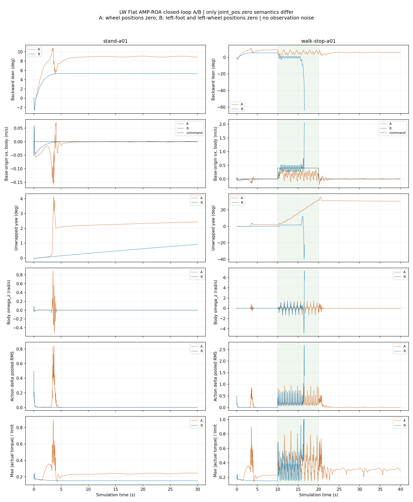

本次闭环 A/B 支持：**joint_pos 置零语义差异会加重当前初态下的站立后仰，但不是全部后仰的充分解释。** 在相同初态、seed=42、模型和物理参数下，只将观测改为旧策略的 Isaac 置零语义，纯站立 10–30 秒平均后仰从 **8.9693° 降到 5.3063°**，B−A = **−3.6629°**（降幅约 40.84%）。B 仍维持约 5.3° 后仰，没有“全部修复”的证据。

B 行走更快，抵达原场景台阶后在 **16.558 s** 触发跌倒阈值；因此 **B 的停止后数据缺失**。这不是四个用例全部完成，也不能将 B 的台阶跌倒直接解释成平地稳定性退化。四次指定运行均只执行一次，失败记录原样保留，未重试、未调整参数、未追加闭环测试。

**身份、来源与授权。** 实际模型 `/home/lfr/rl_sar/policy/LW/robot_lab/leg_loco/policy.onnx` 的 SHA-256 为 `63ef20be03cbba9602d7008e84f605e62ff38cbe9ed64ce25366fdab9d08a1a7`，与指定目标一致；ONNX Runtime 查询接口为 `obs float32 [1,410] → actions float32 [1,10]`。训练身份为用户指定的 `2026-09-04_11-16-35 / model_50000.pt`，任务 Flat AMP-ROA。训练 checkpoint 的本机原文件独立哈希仍不可得，本次验证使用已匹配的导出 ONNX，没有替换模型。

旧诊断包为 `/home/lfr/sim2sim_test/sim2sim_diagnostics/20260910-111515`。其 manifest 全部文件校验通过；旧 `commands.json` 给出实际入口，准确分段逻辑从对应 `tools/collect.cpp` 读取，并由旧遥测命令切换再次核实。旧包中对训练动作顺序的“不确定”描述，已被用户本次提供的真实 act_inference 入口核验事实取代：本次使用已确认的 right/left 交错策略顺序，没有交换动作或电机。

用户批准后才新增独立实验代码。部署仓库 HEAD `93d6c33fa0b8b64a5f5ab75d7c4baac3590352ea`；开始时保留原有 policy.onnx 修改及 `.agents/skills/inspect-context-compactions/`、`library/` 未跟踪状态。所有新文件位于 `/home/lfr/sim2sim_test/sim2sim_diagnostics/20260911-115259-jointpos-ab`，正式 `rl_sar` 源码、配置、模型、policy_storage 和旧诊断包均保留；未安装依赖、训练、访问实物或为本次结果执行 Git 提交/推送。

**最小干预。** [experimental/rl_sdk.patch](experimental/rl_sdk.patch) 展示唯一控制语义变化：在独立复制的 `RL::ComputeLWObservationInto` 的 DofPosition 分支替换“此关节位置是否置零”的判定。A 直接返回原 wheel_mask；B 将已按名称识别的左脚判为置零、右轮判为保留，其余返回原判定。没有修改共享 wheel_mask，所以轮的速度控制、动作映射、默认姿态等仍使用原配置。

|条件|joint_pos[7] 左脚|joint_pos[8] 右轮|joint_pos[9] 左轮|
|---|---|---|---|
|A|自身 q−default_q|0|0|
|B|0|自身 q−default_q|0|

判定位于**单帧缩放/裁剪之前、历史插入之前**。帧构建结束只做只读记录；历史初始化、插入、排列及动作处理仍调用原实现。完整采集工具差异见 [experimental/collect.patch](experimental/collect.patch)。四例用同一个实验二进制，显式参数 A/B 选择分支。

右轮读取的是现有适配器的具名 jointpos 反馈，不是轮速，也没有猜 native 索引。启动时由 `joint_names[joint_mapping[i]]` 查 joint id，再校验 jointpos 传感器引用同一 joint；每帧再次确认采集到的角度与该具名传感器相同。

|关节|策略索引|MJ joint id|qpos 地址|jointpos sensor id / 地址|
|---|---:|---:|---:|---|
|left_foot_joint|7|10|16|7 / 7|
|right_wheel_joint|8|4|10|8 / 8|
|left_wheel_joint|9|9|15|9 / 9|

完整策略顺序保持：right_hip、left_hip、right_thigh、left_thigh、right_shank、left_shank、right_foot、left_foot、right_wheel、left_wheel。各名称、策略索引、MuJoCo joint/qpos/dof/传感器地址随每个原始记录保存。

**配对条件和准确命令。** 物理 MuJoCo **3.2.7**，推理 ONNX Runtime **1.22.0**，CPU 单 intra-op 线程。四例各独立进程，从 `home_leg` reset 的 qpos/qvel 开始，然后沿用旧工具的直接腿式 FSM 激活路径；初态 base `[0,0,.70]` m、wxyz `[1,0,0,0]`，qvel 全零。首动作在 t=.006 s 的 PD 回调生效。没有额外站稳等待、GetUp 插值或中途 reset。

物理 dt=.002 s；名义 PD=.005 s，实际物理边界执行间隔 .006/.004 s 交替；策略=.020 s，decimation=4。仍按旧顺序先 PD/状态发布、后推理，新动作下一次 PD 消费。保留原始传感器求值时差（通常落后当前积分后状态 .002 s）。这保持旧独立诊断工具时序，**不是原交互进程异步调度的验证**。

|用例|仿真时间|vx / vy / wz|
|---|---|---|
|stand-a01|0–30 s|0 / 0 / 0|
|walk-stop-a01|0–10 s|0 / 0 / 0|
|walk-stop-a01|10–20 s|0.4 m/s / 0 / 0|
|walk-stop-a01|20–40 s|0 / 0 / 0|

模型、XML、质量、惯量、COM、接触、初始 qpos/qvel、PD、动作 scale/clip、默认关节角、命令、历史算法均未变。四份实际加载配置去掉实验说明块后完全相同，且新 A 的所有原始 qpos/qvel、模型输入和动作逐样本复现旧 A 对应用例；历史值只是这项独立复核的参考，**表内 A 是本次重新实测结果**。

XML 仍为 `scene.xml → LW.xml`，base 质量10.802295 kg、COM `[.08622748,-.00009382,-.03217461]` m；freejoint frictionloss 六自由度仍为 .2，未顺便修正。平面摩擦 `[.8,.005,.0001]`，保留 x=2.3…4.3 m 的台阶。所有实际 body/joint/actuator/geom/site/sensor 参数在每例 `effective_config.json`，汇总和时间语义在 [runtime_config.json](runtime_config.json)。资源/源码快照在 config_snapshot，链接库路径和 SHA-256 在 [runtime_dependencies.json](runtime_dependencies.json)。

基线没有 joint_pos 观测噪声，故 A/B **均不加噪声**；`joint_pos_before_noise` 与 `joint_pos_sent` 在每例相同。Isaac 的 uniform[-.01,.01] 未引入本次干预，不能宣称整个有噪声输入过程已与 Isaac 完全相同。其他噪声设置、sensor noise 元数据均沿用旧配置，外加 xfrc/qfrc 记录均为零。

精确启动命令（工作目录 `/home/lfr/rl_sar`；完整参数另见 [commands.json](commands.json)）：

```bash
/home/lfr/sim2sim_test/sim2sim_diagnostics/20260911-115259-jointpos-ab/tools/collect /home/lfr/rl_sar/src/rl_sar_zoo/LW_description/mjcf/scene.xml stand-a01 /home/lfr/sim2sim_test/sim2sim_diagnostics/20260911-115259-jointpos-ab/A/stand-a01 A > /home/lfr/sim2sim_test/sim2sim_diagnostics/20260911-115259-jointpos-ab/A/stand-a01/console.log 2>&1
/home/lfr/sim2sim_test/sim2sim_diagnostics/20260911-115259-jointpos-ab/tools/collect /home/lfr/rl_sar/src/rl_sar_zoo/LW_description/mjcf/scene.xml walk-stop-a01 /home/lfr/sim2sim_test/sim2sim_diagnostics/20260911-115259-jointpos-ab/A/walk-stop-a01 A > /home/lfr/sim2sim_test/sim2sim_diagnostics/20260911-115259-jointpos-ab/A/walk-stop-a01/console.log 2>&1
/home/lfr/sim2sim_test/sim2sim_diagnostics/20260911-115259-jointpos-ab/tools/collect /home/lfr/rl_sar/src/rl_sar_zoo/LW_description/mjcf/scene.xml stand-a01 /home/lfr/sim2sim_test/sim2sim_diagnostics/20260911-115259-jointpos-ab/B/stand-a01 B > /home/lfr/sim2sim_test/sim2sim_diagnostics/20260911-115259-jointpos-ab/B/stand-a01/console.log 2>&1
/home/lfr/sim2sim_test/sim2sim_diagnostics/20260911-115259-jointpos-ab/tools/collect /home/lfr/rl_sar/src/rl_sar_zoo/LW_description/mjcf/scene.xml walk-stop-a01 /home/lfr/sim2sim_test/sim2sim_diagnostics/20260911-115259-jointpos-ab/B/walk-stop-a01 B > /home/lfr/sim2sim_test/sim2sim_diagnostics/20260911-115259-jointpos-ab/B/walk-stop-a01/console.log 2>&1
```

**运行结果。**

|条件/用例|实际仿真时长 s|策略步|物理步|状态|
|---|---:|---:|---:|---|
|A/stand-a01|30.000|1500|15000|完成|
|A/walk-stop-a01|40.000|2000|20000|完成|
|B/stand-a01|30.000|1500|15000|完成|
|B/walk-stop-a01|16.558|828|8279|跌倒阈值终止|

总计 5828 个策略周期和 58279 个物理子步。四例各有一次初始 reset，无中途 reset；没有非有限输入/输出。B 行走终止时 upright-axis 总倾斜75.0270°，后仰公式值−69.8905°、roll41.2830°，所以不能把“75°跌倒阈值”当作 pitch=75°。终止位置约 `[2.32543,-.25417,.43472]` m，原因见该例 result.json，退出码3。

**直接输入与历史证据。** 每次底层 ONNX forward 前同步复制完整410维输入、完整当前帧和原始角度/default/dq、命令、映射、四元数；模型返回后保存原始动作，随后记录实际目标/PD写入/所有物理子步及 post 状态。一条完整记录在执行后写入 gzip；异常时保留已捕获的 pending 记录，未获取字段为 null。

每帧 `[0:3]`角速度、`[3:6]`重力、`[6:9]`命令、`[9:19]`位置、`[19:29]`速度、`[29:39]`previous action、`[39:41]`相位保持原顺序。joint_pos scale=1、全帧 clip±100；其他 scale、相位推进、归一化过程均未改变。B 修改的是帧内16/17，410维最新帧385/386；帧内18及最新387在两条件均零。

额外配对检查将**同一份真实推理原始状态**分别送入 A/B 的完整单帧构建函数，存下 `same_state_pair.A_frame/B_frame`，不推进物理、不更新历史、不额外调用策略。5828份配对样本都只允许16/17列不同；选择分支的结果与真正进入 ONNX 的最新帧逐元素一致。独立从每帧原始 q/default_q 复算三列也精确一致，右轮没有用 dq 代替。模型输入初次分化发生在 .02 s（仅410维索引385/386），动作同刻开始分化；原始 qpos 到 .04 s 才分化。后续其它观测列随闭环状态改变是预期结果，没有要求跨轨迹始终只差两列。

对所有模型输入的 **58280个历史帧**（含重叠历史）逐一检查：最新帧末置，10帧从旧到新；每个历史位置等于其实际生成时该条件的完整帧，首次不足10帧时重复该条件首帧；移位和 previous action 精确一致。另有 [frame_checks.json](frame_checks.json) 的16帧离线构建检查，包含两次初始化/reset填充及变化的右轮角；没有物理推进，不能算成额外闭环用例。本次没有测试运行中按 R 的物理 reset：其历史同步边界仍按旧实现，没有擅自修复。

所有已采到的输入/动作有限；具名角度与原传感器一致；离线用前一个物理子步 qpos/qvel 回核传感器时差，误差0；用每次实际PD传感器状态回核候选力矩、从原始动作回核新目标，误差均为0。逐项结果见 [validation.json](validation.json)。

**姿态、速度和统计口径。** base 四元数为 freejoint/base_link 的 **wxyz，body→world**。按用户指定原始公式 `degrees(asin(clamp(2*(qx*qz-qw*qy),-1,1)))`，后仰为正；保留原始四元数和 ZYX pitch/roll。所有统计来自原始推理前状态；标准差为总体标准差、P5/P95为逐样本分位数，窗口左闭右开。

`base_origin_linear_velocity_world=qvel[:3]` 是自由关节原点速度，机体系用 `R.T @ v_world`。`base_com_linear_velocity_*` 单独保存质心速度，不混用测量点。下表 vx 是原点机体系速度，误差=实际 vx−实际观测命令。body/world角速度均保存，yaw用展开后的ZYX航向角。ωz机体系与 yaw 欧拉角导数不是同一量；二者都在统计JSON中，报告明确注明采用哪个。

**规定窗口后仰对比。** B 15–20 s 仅有15–16.558 s的78个推理前样本（最后样本t=16.54），包含台阶接触和跌倒过渡；其负均值不是“站得更直”，不能与 A 完整250点求整窗差值。B 未到停止阶段，所有停止后统计保留 null。

|窗口|A 均值±标准差 °|A P5/P95 °|B 均值±标准差 °|B P5/P95 °|B−A 均值 °|样本/覆盖|
|---|---:|---:|---:|---:|---:|---|
|站立 5–10 s|8.6545 ± 0.3011|7.9907 / 8.9176|5.3180 ± 0.0018|5.3160 / 5.3218|-3.3365|A 250；B 250|
|站立 10–30 s|8.9693 ± 0.0642|8.8748 / 9.0675|5.3063 ± 0.0030|5.3023 / 5.3132|-3.6629|A 1000；B 1000|
|行走用例 5–10 s|8.6545 ± 0.3011|7.9907 / 8.9176|5.3180 ± 0.0018|5.3160 / 5.3218|-3.3365|A 250；B 250|
|行走用例 15–20 s|5.5801 ± 1.3768|3.4762 / 8.3197|-9.0063 ± 13.4139|-34.6326 / 0.9492|未采到|A 250；B 78；B 仅15–16.558 s，禁止整窗差值|
|行走用例 20–22 s|4.0503 ± 1.6379|2.3039 / 8.3504|未采到|未采到|未采到|A 100；B 0；B 跌倒后未到达|
|行走用例 22–30 s|5.5880 ± 0.4607|4.4472 / 6.0214|未采到|未采到|未采到|A 400；B 0；B 跌倒后未到达|
|行走用例 30–40 s|5.8157 ± 0.2533|5.3129 / 6.0784|未采到|未采到|未采到|A 500；B 0；B 跌倒后未到达|

所有均值、标准差、分位数的 B−A 数值见 [comparison.json](comparison.json)；不完整窗口的差值为 null。[statistics.json](statistics.json) 保存每个关节和全部速度/姿态详细统计。

**规定窗口的运动、振荡和饱和。** 关节去趋势波动指每个关节 q 在窗口内扣除拟合直线后的标准差，再对8个非轮关节取 pooled RMS，表中换算为度；动作步差 RMS 指窗口内相邻原始/裁剪后相同动作的差，对10个通道汇总。它们描述运动幅度/变化，不能单凭值变大判为不稳定，尤其行走速度不同。完整 per-joint std、dq RMS、动作 std/步差在JSON。

|条件/窗口|vx 机体系均值 m/s|速度误差 RMSE m/s|yaw 净变化 °|ωz 机体系均值 / RMS rad/s|关节去趋势波动 °|动作步差 RMS|力矩饱和子步率|
|---|---:|---:|---:|---:|---:|---:|---:|
|A 站立 5–10 s|-0.002704|0.003984|0.1156|0.000081 / 0.000096|0.055667|0.000718|0.0000%|
|A 站立 10–30 s|0.000023|0.000645|0.2282|0.000124 / 0.000149|0.035136|0.000286|0.0000%|
|A 行走用例 5–10 s|-0.002704|0.003984|0.1156|0.000081 / 0.000096|0.055667|0.000718|0.0000%|
|A 行走用例 15–20 s|0.140545|0.279793|16.0434|0.032493 / 0.457545|7.070653|0.245920|0.0000%|
|A 行走用例 20–22 s|-0.002174|0.079986|-0.8227|0.010390 / 0.286289|2.399810|0.212470|0.0000%|
|A 行走用例 22–30 s|-0.002984|0.011287|-0.1785|-0.000758 / 0.004367|0.196999|0.009307|0.0000%|
|A 行走用例 30–40 s|0.000364|0.006474|-0.3926|-0.000213 / 0.003278|0.195004|0.004669|0.0000%|
|B 站立 5–10 s|0.000004|0.000023|0.1664|0.000416 / 0.000449|0.001516|0.000268|0.0000%|
|B 站立 10–30 s|-0.000011|0.000026|0.6078|0.000373 / 0.000412|0.003410|0.000258|0.0000%|
|B 行走用例 5–10 s|0.000004|0.000023|0.1664|0.000416 / 0.000449|0.001516|0.000268|0.0000%|
|B 行走用例 15–20 s（B 部分窗口）|0.510591|0.381860|未采到|-0.028318 / 1.610922|11.037743|0.643496|7.7022%|

纯站立10–30 s，B 的关节波动由0.035136°降至0.003410°，动作步差由0.000286降至0.000258；无饱和、无跌倒，实际 vx 接近零。不过该稳态窗口净 yaw 漂移由A的0.2282°增至B的0.6078°，是小幅变差，不能用整段包含启动瞬态的 yaw 改善掩盖它。

**接触台阶前共同完整的10–15 s窗口。** 这是对已有数据的补充分析，没有新增测试、没有替换规定15–20 s窗口。两条件均有250点且没有台阶接触；包含发出前进命令后的启动阶段。

|10–15 s 指标|A|B|B−A|
|---|---:|---:|---:|
|后仰均值 °|5.092139|0.117573|-4.974566|
|实际 vx 均值 m/s|0.155450|0.361139|0.205689|
|速度误差均值 m/s|-0.244550|-0.038861|0.205689|
|机体系 yaw-rate 均值 rad/s|0.043472|0.019687|-0.023784|
|速度跟踪 RMSE m/s|0.272248|0.113848|-0.158400|
|速度跟踪 MAE m/s|0.245369|0.091351|-0.154018|
|yaw 净变化 °|13.505291|1.394314|-12.110977|
|八个腿关节去趋势波动 °|7.158689|8.401625|1.242936|
|动作步差 RMS|0.252532|0.260637|0.008105|
|饱和子步率|0.000000|0.000000|0.000000|
|机体系 yaw-rate RMS rad/s|0.432562|0.461923|0.029362|

该窗口 B 后仰均值±标准差为0.1176±1.1709°，P5/P95 −1.4053°/1.6779°；A为5.0921±2.2368°，P5/P95 1.1380°/8.5895°。B 的平均速度更接近.4 m/s、净偏航更小，但 yaw-rate RMS由.43256增至.46192 rad/s、腿关节波动由7.15869增至8.40163°，动作步差也略增。这些是在不同闭环步态/速度下的实测伴随变化，不支持“所有转向/稳定性指标都改善”。详细同窗 B−A 见 [supplemental_analysis.json](supplemental_analysis.json)。

**停止后漂移。** 下表只报告本次 A 实测值，B 均为缺失。净漂移是窗口两端 base 原点 xy 位移长度；累计路径为所有20 ms xy样本路径长度，保留往复运动、不平滑。其余世界xy分量及起始航向投影在JSON。

|停止后窗口|A 净平面漂移 m|A 平面累计路径 m|B|
|---|---:|---:|---|
|20-22 s|0.007196|0.207605|未到停止阶段|
|22-30 s|0.024103|0.051367|未到停止阶段|
|30-40 s|0.004920|0.049202|未到停止阶段|
|20-40 s|0.025708|0.308174|未到停止阶段|
|22-40 s|0.019983|0.100569|未到停止阶段|

**跌倒证据链及限制。** B 的第一个已记录有效台阶接触出现在 **15.540 s**，第一阶 geom id=1 与 `right_foot_collision`（geom18），边界复算接触法向力约317.29 N。该台阶中心 `[2.3,0,.02]` m、半尺寸 `[.2,2,.05]` m，前缘x=2.1 m，顶面z=.07 m。这里是20 ms边界上首次记录到的接触，不声称它是精确的物理子步碰撞起点。

首次实际执行器饱和出现在16.340 s的积分区间，右脚达到−27 N·m；后续右膝/小腿关节 `right_shank_joint` 达到120 N·m。B行走全程右脚和右小腿饱和子步率分别约0.1329%和0.6643%，均发生于该接触之后；同窗10–15 s两条件均无饱和。16.558 s总倾斜超过75°终止。A没有台阶接触且完整走完，因其速度低、行进距离短。接触、饱和、姿态及终止时间在原始数据和 supplemental JSON中相互对应；接触力来自只读复制mjData上的边界求解，实际actuator force来自原物理子步，二者时间含义分开标注。

这一时序提示B的台阶交互是本次失败的重要候选过程，但没有对照证明台阶是唯一原因，也没有足够证据判断B在无限平地是否最终会失稳。不能把发生更早的接触与更快的轨迹忽略，然后把“B跌倒”当作置零语义必然破坏平地稳定性的证明。B还没收到停止命令，不能评价其停止后后仰和漂移。



**结论与未排除的解释。**

1. **置零语义已匹配。** B的左脚/左轮为零，右轮是自身真实角度减默认角；完整历史和同状态配对检查通过。这里只匹配置零位置，未声称无噪声MuJoCo与有uniform噪声Isaac的全部输入分布相同。
2. **站立后仰确实减轻。** 同模型、同物理、同初态的干预使10–30 s均值下降3.6629°，支持这项观测差异对原后仰加重有因果贡献，证据强于此前只比较两台引擎均值。B仍约5.3063°后仰，不能称其为唯一根因或已完全修复。
3. **性能变化有取舍。** 初始站立更平稳、行走前段速度与净航向跟踪改善，但部分角速度/关节运动波动增加，静止稳态yaw漂移略增。B在台阶处跌倒，停止后性能未验证。未获得“整体稳定性普遍改善”的结论。
4. **尚未隔离两项置零变化各自的作用。** B同时置零左脚并恢复右轮角，当前A/B不能区分二者的独立贡献或交互；不能直接归因只在左脚。单初态/单种子不能推广到所有姿态、场景、扰动和命令历史。残余后仰还可能与训练本身、噪声/初态差异或物理配置有关，本次没有额外干预证明其中一项。

先前Isaac无推力初始站立参考均值2.28°，B本次5–10 s仍比其高约3.0380°；这仅是参考记录差别，本次没有在Isaac重新运行匹配的配对实验。此前含组合转向的停止后3.86°参考不用于替代缺失的B停止后数据。

**下一步建议，仅建议、未执行。** 对残余站立后仰，最有区分力的是拆分观测干预：保持同一纯站立场景，分别仅置零左脚、仅恢复右轮角，与当前A/B组成因子对照，区分独立贡献和交互。为获得有效停止后对照，应另行批准一个无前方台阶的平地场景，用相同A/B、初态和40 s日程重测，先消除提前接触台阶造成的截断。之后若仍需解释Isaac数值差距，再依据训练端有效配置设计配对噪声/初始化单因素对照；不要直接修改COM或PD追求均值更接近。

**视频、数据精度与交付。** 四段视频位于 `A|B/<case>/side_view.mp4`，均为闭环日志的**离线回放**，没有重新积分或重新调用策略。使用已安装MuJoCo3.7.0仅渲染记录qpos/qvel；物理采集始终3.2.7。50 fps，每个策略周期的pre状态一帧，叠加实际仿真时间、命令、条件、后仰角，摄像机按yaw跟随侧视、elevation=0°，body+X前方明确标注。全部5828帧解码检查通过。B行走视频828帧、16.56 s，最后显示的pre状态为16.54 s；实际终止post=16.558 s已在完整数值日志中，视频帧间不插值，也不拿斜视画面估计角度。

原始 `telemetry.jsonl.gz` 包含pre/模型前状态、完整模型输入、current joint_pos及same_state_pair、raw action、新目标、全部PD写入、全部子步ctrl/actuator_force/qfrc_actuator、post、reset/终止标志；派生值在各例 `derived.jsonl.gz`。向量按实际float32/float64可往返数值保存，无降采样、平滑或提前舍入。报告表格显示位数仅为阅读，精确值以JSON为准。未采到的B停止后数据是null，不填零。

目录 `/home/lfr/sim2sim_test/sim2sim_diagnostics/20260911-115259-jointpos-ab`；压缩包 `/home/lfr/sim2sim_test/sim2sim_diagnostics/20260911-115259-jointpos-ab.tar.gz`。一个汇总report.md、一个总览图，A/B实际配置、命令、代码差异、控制日志、视频、验证JSON和SHA-256清单一并交付；不含模型权重、整个仓库或依赖环境，原目录和旧包都保留。所有文件哈希在manifest.json，manifest自身和压缩包分别用旁置SHA-256文件校验。

**补充的 roll 与接触窗口核对。** 接触率为策略边界上具名脚几何与地面/台阶的有效接触占比；它不是每个物理子步的接触占比。下列窗口均无 reset，B 行走15–20 s仅统计已采到部分。

|条件/用例/窗口 s|roll 均值±标准差 °|左脚接触率|右脚接触率|双脚均不接触率|
|---|---:|---:|---:|---:|
|A/stand-a01 5–10|-0.8840 ± 0.0186|100.00%|100.00%|0.00%|
|A/stand-a01 10–30|-0.9738 ± 0.0227|100.00%|100.00%|0.00%|
|A/walk-stop-a01 5–10|-0.8840 ± 0.0186|100.00%|100.00%|0.00%|
|A/walk-stop-a01 15–20|-3.1452 ± 3.9012|58.00%|56.00%|0.00%|
|A/walk-stop-a01 20–22|-3.1048 ± 1.3378|97.00%|88.00%|0.00%|
|A/walk-stop-a01 22–30|-2.7766 ± 0.0761|100.00%|100.00%|0.00%|
|A/walk-stop-a01 30–40|-2.6838 ± 0.0882|100.00%|100.00%|0.00%|
|B/stand-a01 5–10|-0.0331 ± 0.0047|100.00%|100.00%|0.00%|
|B/stand-a01 10–30|-0.0869 ± 0.0265|100.00%|100.00%|0.00%|
|B/walk-stop-a01 5–10|-0.0331 ± 0.0047|100.00%|100.00%|0.00%|
|B/walk-stop-a01 15–20（部分）|1.1659 ± 5.8217|66.67%|53.85%|6.41%|

**未获取或不适用的信号。** B 行走终止之后的状态、15–20 s剩余部分和所有停止后窗口未获取；未进行新的Isaac配对运行。训练 checkpoint 原文件在本机不可得，不能独立复核其哈希。ONNX外部接口只有obs/actions，没有显式recurrent state或reset mask可记录；历史作为410维obs的一部分已完整保存。脚接触力只采集策略边界，未采集每个2 ms子步的完整接触求解量；每个物理子步的执行器力/广义力已采集。视频为日志离线回放，没有闭环运行时实时渲染视频。实际中途物理reset未触发，B reset后填充路径只由离线构建检查覆盖，不能称为中途reset闭环验证。

最终数值检查见[final_checks.json](final_checks.json)：全部原始数值有限，逐步时序/命令一致；本次所有原始动作均未触发±100裁剪；正式源码/配置/模型、旧包manifest及其全部文件哈希保持一致。
