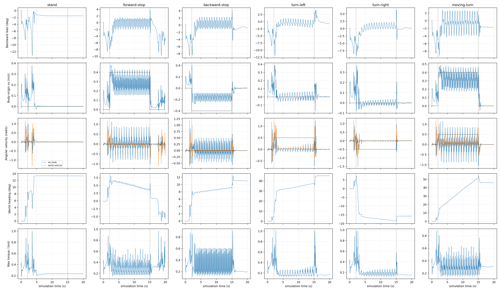

本轮完全平地 MuJoCo 评估完成 **6/6个20秒用例**，共120秒、6000个策略步、60000个物理子步，无跌倒、非有限值或提前终止。申请的8秒闭环reset检查因现有部署缺少联合reset流程，按用户批准的方案标记 **not_executed**，没有用离线张量清零代替，也没有消耗剩余预算追加测试。

**主要结果。** 零指令站立并非全程不漂：前5秒向世界+X位移约 **0.532 m**，随后5–15秒平均vx为 **+0.000423 m/s**，净平面位移约4.78 mm；该稳态后仰角 **−1.463°±0.084°**，即轻微前倾，没有持续站立后仰的证据。初始位移/偏航是这次明确定义的home_leg启动流程下实测，不能用后段接近零的速度掩盖。

前进/后退主运动窗的实际vx分别 **+0.2804/−0.1628 m/s**，低于±0.4命令幅度。**直行停车后仍有显著残余前移**：17–20秒平均vx **+0.08554 m/s**，净平面位移 **0.26341 m**，平均后仰 **−4.703°**（前倾）；而后退停止与前进转向停止后的同窗净位移约1.30 mm和0.125 mm。这种命令历史差别尚无独立干预证明根因。

纯左/右转向确实产生世界航向变化，2–5秒分别+26.368°/−21.577°，但5–15秒仅 **+6.275°/−2.135°**，持续响应很弱；前进转向同窗 **+28.729°**。不能将局部wz均值很小误报为“完全没有转向”，也不能把启动时转角当作持续跟踪成功。逐秒航向增量在[event_details.json](event_details.json)。

**身份和边界。** 部署端host_id **LFR**；接收端ID younghit。本次使用归档 `LW/leg_loco/2026-09-11-16-56-27`，归档提交 `153c380b830ee3a44b1cbac1d3d8acf6d7557fc5` 已核对。任务 RobotLab-Isaac-Velocity-Flat-LW-leg-Amp-Roa-v0；AMPROAPPO / OnPolicyRunnerAmpROA；训练run 2026-09-11_16-56-27，model_50000.pt。

真正加载的模型：`/home/lfr/sim2sim_test/sim2sim_work/20260912-162601-flat-20260911/policy/LW/robot_lab/leg_loco/policy.onnx`；SHA-256 `3f11bd36f147b3308354c5dca9f7474f0b0c039922586ef35b230584223303a2`，与指定ONNX完全一致。归档JIT也校验为`64b411b440898c15df2340ba68ccef135c68b07dfa71e92ce1c20005037195a1`，但本次未用JIT执行。模型权重只在隔离运行目录中保存，按既有报告契约不放入传输包；接收端应使用相同哈希模型独立重放实际输入。归档archive_manifest.json和策略说明.txt原样随包保存，其中训练电脑绝对路径是历史来源信息，不作为本机缺失故障，也不要求提供训练argv或checkpoint。

该检查点包含轮位置置零索引修复；**不包含**后续stand_still排除轮位置、转向专家、收紧跟踪std修改。不能把本次现象归因于这些尚未进入模型的修改。来源说明中的训练条件和Isaac参考不是本轮重新验证的训练实验。

部署仓库HEAD `536e94dab10eedb31971c8b741f8b915163aa353`；启动dirty状态见plan.json，保留leg_loco/wheel_loco模型修改、inspect-context-compactions和library未跟踪状态。此次仅新增独立采集/分析工具和隔离场景，没有修改生产观测、历史、动作、PD、机器人参数或模型，没有训练、安装依赖、硬件访问或自动Git提交/推送。

**场景、初态和实际时序。** 由当前scene.xml生成隔离完全平地场景，只删除六个前方台阶；无斜坡、无障碍物；floor无限水平平面，接触参数保持原值。机器人LW.xml、质量/惯量/COM、关节与执行器参数原样保留，场景diff在config_snapshot/flat_scene.patch。所有用例xfrc_applied和qfrc_applied均为0，无随机推扰。

物理 MuJoCo **3.2.7**，ONNX Runtime **1.22.0**，现有CPU推理后端；库路径/哈希在runtime_dependencies.json。实际物理dt **0.002 s**；YAML名义PD=.005 s，物理边界实际 **.006/.004 s交替**，decimation=4、策略周期=.02 s。Isaac参考物理dt=.005 s、策略=.02 s；本次没有改本机步长。原程序float32周期为0.019999999552965164，相位累加按原精度运行。采集调度沿用此前已验证的同步诊断时序，未声称验证了交互程序的异步线程调度。

各用例新进程、srand(42)，无显式随机化。初态home_leg：base原点[0,0,.7] m，wxyz[1,0,0,0]，全部qvel为0；具名关节初始q见effective_config，直接进入原LegLocomotion Enter/Activate路径，无额外GetUp插值或站稳等待。策略首输出在t=0构建、下一次PD即t=.006开始消费；每个策略边界先使用前一输出做PD并发布状态，然后推理。不能把新目标当作同一边界已经施加的ctrl。

实际适配器传感器通常反映前一个物理步开始状态，即比policy边界积分后qpos/qvel落后.002秒；6000帧原始q/dq按该求值时间与全物理日志精确核对。pre/post基座原点、COM、世界/机体系速度分别命名。物理子步中force/contact/足端动力学量标注from_sim_time，积分后qpos/qvel标注to_sim_time；复制mjData重算的边界接触与真实物理子步接触另行区分。

终止判据：非有限输入/动作/qpos/qvel、MuJoCo警告、运行时安全锁定、base高度<.25 m、upright总倾斜>75°或base_collision接触；每例120秒采集墙钟超时，外层135秒兜底。此次未触发。总倾斜阈值不是pitch阈值。初始reset各1次，窗口0–2秒标记含初始reset，没有中途reset样本混入其它窗口。

**命令和精确执行入口。** stand全程0；其余用例0–2秒0，2–15秒分别[.4,0,0]、[−.4,0,0]、[0,0,.5]、[0,0,−.5]、[.4,0,.5]，15–20秒0。全部计划/实际/模型命令相同。工作目录`/home/lfr/rl_sar`；逐例精确argv与重定向如下，也保存在commands.json及process.json：

```bash
/home/lfr/sim2sim_test/sim2sim_diagnostics/20260912-162601-flat-20260911/tools/collect /home/lfr/sim2sim_test/sim2sim_diagnostics/20260912-162601-flat-20260911/plan.json stand /home/lfr/sim2sim_test/sim2sim_diagnostics/20260912-162601-flat-20260911/cases/stand > /home/lfr/sim2sim_test/sim2sim_diagnostics/20260912-162601-flat-20260911/cases/stand/console.log 2>&1
/home/lfr/sim2sim_test/sim2sim_diagnostics/20260912-162601-flat-20260911/tools/collect /home/lfr/sim2sim_test/sim2sim_diagnostics/20260912-162601-flat-20260911/plan.json forward-stop /home/lfr/sim2sim_test/sim2sim_diagnostics/20260912-162601-flat-20260911/cases/forward-stop > /home/lfr/sim2sim_test/sim2sim_diagnostics/20260912-162601-flat-20260911/cases/forward-stop/console.log 2>&1
/home/lfr/sim2sim_test/sim2sim_diagnostics/20260912-162601-flat-20260911/tools/collect /home/lfr/sim2sim_test/sim2sim_diagnostics/20260912-162601-flat-20260911/plan.json backward-stop /home/lfr/sim2sim_test/sim2sim_diagnostics/20260912-162601-flat-20260911/cases/backward-stop > /home/lfr/sim2sim_test/sim2sim_diagnostics/20260912-162601-flat-20260911/cases/backward-stop/console.log 2>&1
/home/lfr/sim2sim_test/sim2sim_diagnostics/20260912-162601-flat-20260911/tools/collect /home/lfr/sim2sim_test/sim2sim_diagnostics/20260912-162601-flat-20260911/plan.json turn-left /home/lfr/sim2sim_test/sim2sim_diagnostics/20260912-162601-flat-20260911/cases/turn-left > /home/lfr/sim2sim_test/sim2sim_diagnostics/20260912-162601-flat-20260911/cases/turn-left/console.log 2>&1
/home/lfr/sim2sim_test/sim2sim_diagnostics/20260912-162601-flat-20260911/tools/collect /home/lfr/sim2sim_test/sim2sim_diagnostics/20260912-162601-flat-20260911/plan.json turn-right /home/lfr/sim2sim_test/sim2sim_diagnostics/20260912-162601-flat-20260911/cases/turn-right > /home/lfr/sim2sim_test/sim2sim_diagnostics/20260912-162601-flat-20260911/cases/turn-right/console.log 2>&1
/home/lfr/sim2sim_test/sim2sim_diagnostics/20260912-162601-flat-20260911/tools/collect /home/lfr/sim2sim_test/sim2sim_diagnostics/20260912-162601-flat-20260911/plan.json moving-turn /home/lfr/sim2sim_test/sim2sim_diagnostics/20260912-162601-flat-20260911/cases/moving-turn > /home/lfr/sim2sim_test/sim2sim_diagnostics/20260912-162601-flat-20260911/cases/moving-turn/console.log 2>&1
```

**实际输入契约核验。** 输入直接复制底层forwardInto收到的TensorView，发生在真正ONNX执行前；不是用状态重建或读取旧debug缓存。完整输入和完整当前帧在每条telemetry中，重建仅用于独立核验。所有结果见input_validation.json。

|项目|结论|证据/差异|
|---|---|---|
|接口|匹配|ONNX Runtime 实际查询 obs float32[1,410] → actions float32[1,10]；文件结构确认 opset17、静态 batch1|
|历史布局|匹配|全部6000个实际TensorView输入、60000个重叠历史帧，旧→新，最新在末尾；初始10帧重复当前首帧，随后每周期移位一次|
|关节位置/轮屏蔽|匹配|q-default_q；10帧各自17、18列严格为0；其余8关节逐样本等于当前原始角度减default；没有屏蔽左脚|
|关节速度|匹配|具名qpos/qvel和传感器映射核验；dq×0.05，轮速度保留；缩放误差0|
|机身角速度|匹配|实际机体系传感器值×0.25，误差0；机体系/世界系/航向变化分开保存|
|重力和坐标|匹配到float32精度|body→world wxyz，body+X前向/+Z向上，R.T×[0,0,-1]；输入复算最大误差小于2e-7|
|命令|匹配|计划值、控制器实际值、输入6:9逐样本一致；无交互覆盖|
|previous action|匹配|上一模型输出经过原有±100动作裁剪、尚未scale/default偏置；初始为0；全部样本精确一致|
|相位启用条件|匹配|完整三维命令范数>0.1；纯左右转±0.5时相位启用，零命令时[0,0]|
|相位与episode时间|不一致，原状保留|时钟每次推理前先加0.02×1.25；相对本次记录episode时间约提前0.02秒，即9°相位。运动样本与指定公式最大分量误差0.15643038|
|相位隐藏时钟|已确认|零命令屏蔽期间时钟仍继续；在2秒启用时没有重新置零；实际float32递推复算误差≤5.96e-8|
|reset后历史/相位|未验证；现有流程不足|部署R只mj_resetDataKeyframe+mj_forward；历史/相位在策略activation generation变化时才重置，没有现成的联合reset调用。8秒用例未执行|
|归一化|未新增，符合关闭设置|部署没有额外观测归一化；导出图无normalizer参数或归一化算子，包含完整actor输入组合，不在外部重复拼接|
|噪声|条件不同，如实保留|部署不加观测噪声；训练非轮位置有噪声。未为本次临时加噪；轮输入始终0|
|动作处理|匹配部署配置|前8维位置scale=.25加default，后2维轮速度scale=1；保留raw/clip/scale/target/PD/实际ctrl，目标及PD复算误差0|


相位的9°指的是**步态相位角**，不是机身姿态角。首个运动输入在t=2.00 s应按指定公式得到sin/cos约[0,−1]，实际约[−0.15643,−0.98769]，对应先推进一帧。屏蔽期间时钟仍累计。此差异可作为后续单因素验证候选，但本轮没有改动，不能直接断言它导致停车前漂或转向不足。

每帧顺序与单位：0:3 body角速度rad/s×.25；3:6无量纲单位重力投影；6:9 vx/vy m/s、wz rad/s×1；9:19关节位置rad相对default×1（轮置0）；19:29关节速度rad/s×.05；29:39 previous action无量纲；39:41 sin/cos。全帧原有clip±100；actual raw action也按原有各通道±100先裁剪再缩放。本轮无动作裁剪事件。

|关节|策略索引|配置mapping|MJ joint id|qpos地址|qvel地址|位置sensor地址|
|---|---|---|---|---|---|---|
|right_hip_joint|0|0|1|7|6|0|
|left_hip_joint|1|1|6|12|11|1|
|right_thigh_joint|2|2|2|8|7|2|
|left_thigh_joint|3|3|7|13|12|3|
|right_shank_joint|4|4|3|9|8|4|
|left_shank_joint|5|5|8|14|13|5|
|right_foot_joint|6|6|5|11|10|6|
|left_foot_joint|7|7|10|16|15|7|
|right_wheel_joint|8|8|4|10|9|8|
|left_wheel_joint|9|9|9|15|14|9|


默认策略关节姿态rad：`[0.0, 0.0, -0.43630000948905945, 0.43630000948905945, -2.2339999675750732, 2.2339999675750732, -0.47119998931884766, 0.47119998931884766, 0.0, 0.0]`。腿Kp/Kd：hip/thigh/shank为90/3，foot为28/1.4；轮0/.5。腿目标q=default_q+.25×clipped_action；轮dq=1×clipped_action，轮q保持default、Kp=0。PD候选τ=τff+Kp(qtarget−qsensor)+Kd(dqtarget−dqsensor)，按原有力矩上下限裁剪后写入ctrl；实际gear/ctrlrange/forcerange及所有body/joint参数在runtime_config.json和每例effective_config.json。freejoint frictionloss六自由度均.2，标量关节damping=.01、armature=.01、frictionloss=.2，均保留。

**5–15秒主运动窗口。** 各500个推理前样本，标准差为总体std，P5/P95为原始样本分位数；RMSE针对实际进入模型的命令。vx/vy是基座自由关节原点速度在机体系的分量；wz_body与wz_world是角速度向量在不同轴上的分量；世界航向由原始四元数ZYX解算并展开，两端t=5/15取差。它们不能混用。详细heading欧拉角导数及对应误差也保存在统计JSON。

|用例|N|vx均值|vx RMSE|vy均值|vy RMSE|wz body均值|wz body RMSE|wz world均值|净航向°|后仰均值±std°|
|---|---|---|---|---|---|---|---|---|---|---|
|stand|500|0.00042|0.00134|-0.00023|0.00304|0.00008|0.00477|-0.00005|-0.027|-1.463 ± 0.084|
|forward-stop|500|0.28043|0.14046|-0.00633|0.22632|-0.00140|0.31596|-0.00604|-2.786|0.272 ± 0.964|
|backward-stop|500|-0.16279|0.24257|-0.00838|0.14143|0.00091|0.20437|0.00279|0.927|0.435 ± 0.939|
|turn-left|500|0.00052|0.03125|-0.00041|0.04856|0.00827|0.49523|0.01142|6.275|-0.565 ± 0.741|
|turn-right|500|-0.00049|0.01660|-0.00072|0.01850|-0.00250|0.49782|-0.00352|-2.135|0.804 ± 0.750|
|moving-turn|500|0.31574|0.11550|0.00299|0.22247|0.03315|0.56319|0.05826|28.729|-0.171 ± 1.791|


**17–20秒停车残余运动。** 各150个样本；stand行是持续零命令的参照，不是停车动作。平面速度/位移使用世界xy；累计路径保留往复运动。前进停止是本轮最突出的残余运动问题，没有因其它停车用例较稳而忽略它。

|用例|vx均值m/s|vx RMSE|平面速度均值m/s|净平面位移m|累计路径m|净航向°|后仰均值°|
|---|---|---|---|---|---|---|---|
|stand|-0.00004|0.00043|0.00175|0.00011|0.00454|-0.007|-1.507|
|forward-stop|0.08554|0.10042|0.12503|0.26341|0.37528|-6.955|-4.703|
|backward-stop|-0.00033|0.00242|0.00218|0.00130|0.00651|-0.055|-0.635|
|turn-left|0.00129|0.00181|0.00176|0.00383|0.00525|-0.010|-0.478|
|turn-right|-0.00104|0.00301|0.00267|0.00311|0.00799|0.032|0.197|
|moving-turn|0.00000|0.00018|0.00018|0.00013|0.00047|-0.037|-1.711|


**所有规定窗口。** 依次100、150、500、100、150个样本，合计每例1000。净位移使用窗口两端位置；姿态统计左闭右开。后仰正值/前倾负值来自 `degrees(asin(clamp(-projected_gravity_b.x,-1,1)))`；raw四元数、ZYX pitch/roll另存，未使用roll或总倾斜替代pitch。与四元数和单位重力独立计算一致。

|用例|秒|N|vx均值|vy均值|wz body|wz world|Δyaw°|后仰均值±std°|后仰P5/P95°|roll均值±std°|净xy位移m|饱和子步%|超速子步%|
|---|---|---|---|---|---|---|---|---|---|---|---|---|---|
|stand|0–2|100|0.11271|0.00262|0.00600|0.04815|5.196|-4.557 ± 1.864|-8.174 / -2.115|-1.451 ± 2.164|0.22715|0.000|0.400|
|stand|2–5|150|0.09873|-0.02552|0.04343|0.04810|8.150|-3.615 ± 3.109|-11.190 / -0.594|-3.046 ± 1.810|0.30749|0.533|0.267|
|stand|5–15|500|0.00042|-0.00023|0.00008|-0.00005|-0.027|-1.463 ± 0.084|-1.520 / -1.262|-1.469 ± 0.009|0.00478|0.000|0.000|
|stand|15–17|100|-0.00004|0.00006|-0.00007|-0.00004|-0.005|-1.512 ± 0.004|-1.517 / -1.504|-1.468 ± 0.006|0.00014|0.000|0.000|
|stand|17–20|150|-0.00004|0.00001|-0.00009|-0.00004|-0.007|-1.507 ± 0.005|-1.515 / -1.499|-1.466 ± 0.007|0.00011|0.000|0.000|
|forward-stop|0–2|100|0.11271|0.00262|0.00600|0.04815|5.196|-4.557 ± 1.864|-8.174 / -2.115|-1.451 ± 2.164|0.22715|0.000|0.400|
|forward-stop|2–5|150|0.30724|-0.01456|0.00015|0.00272|0.961|-1.848 ± 2.690|-6.682 / 1.141|-1.350 ± 3.117|0.93175|0.000|0.933|
|forward-stop|5–15|500|0.28043|-0.00633|-0.00140|-0.00604|-2.786|0.272 ± 0.964|-1.718 / 1.296|-0.544 ± 2.739|2.83160|0.000|1.000|
|forward-stop|15–17|100|0.05233|0.02790|-0.04976|-0.02446|-2.596|-0.131 ± 1.249|-1.727 / 1.758|-1.869 ± 1.175|0.11517|0.000|0.000|
|forward-stop|17–20|150|0.08554|-0.01471|-0.02407|-0.04148|-6.955|-4.703 ± 1.808|-8.411 / -2.426|-2.628 ± 1.404|0.26341|0.000|0.200|
|backward-stop|0–2|100|0.11271|0.00262|0.00600|0.04815|5.196|-4.557 ± 1.864|-8.174 / -2.115|-1.451 ± 2.164|0.22715|0.000|0.400|
|backward-stop|2–5|150|-0.14056|-0.01386|0.01927|0.01924|2.900|-1.389 ± 2.494|-6.754 / 1.557|-2.250 ± 3.024|0.42834|0.000|0.333|
|backward-stop|5–15|500|-0.16279|-0.00838|0.00091|0.00279|0.927|0.435 ± 0.939|-0.925 / 2.079|-0.337 ± 0.755|1.64363|0.000|0.000|
|backward-stop|15–17|100|-0.02149|-0.00104|-0.00498|0.01993|2.038|-1.037 ± 1.291|-3.146 / 1.869|-1.635 ± 1.053|0.04351|0.000|0.000|
|backward-stop|17–20|150|-0.00033|-0.00030|-0.00018|-0.00032|-0.055|-0.635 ± 0.155|-0.936 / -0.467|-2.145 ± 0.043|0.00130|0.000|0.000|
|turn-left|0–2|100|0.11271|0.00262|0.00600|0.04815|5.196|-4.557 ± 1.864|-8.174 / -2.115|-1.451 ± 2.164|0.22715|0.000|0.400|
|turn-left|2–5|150|0.05718|-0.01764|0.10858|0.15337|26.368|-2.654 ± 2.994|-9.363 / 0.136|-1.783 ± 1.612|0.17419|0.200|0.467|
|turn-left|5–15|500|0.00052|-0.00041|0.00827|0.01142|6.275|-0.565 ± 0.741|-1.732 / 0.888|-1.937 ± 0.425|0.00917|0.000|0.000|
|turn-left|15–17|100|0.03725|-0.00811|0.05249|0.06474|7.256|1.214 ± 1.179|-0.100 / 3.375|-1.202 ± 0.945|0.07600|0.500|0.000|
|turn-left|17–20|150|0.00129|-0.00019|0.00043|-0.00007|-0.010|-0.478 ± 0.205|-0.723 / -0.195|-0.838 ± 0.145|0.00383|0.000|0.000|
|turn-right|0–2|100|0.11271|0.00262|0.00600|0.04815|5.196|-4.557 ± 1.864|-8.174 / -2.115|-1.451 ± 2.164|0.22715|0.000|0.400|
|turn-right|2–5|150|0.03897|-0.02557|-0.05437|-0.12856|-21.577|-2.434 ± 2.790|-7.619 / 0.966|1.282 ± 2.585|0.13686|0.000|0.733|
|turn-right|5–15|500|-0.00049|-0.00072|-0.00250|-0.00352|-2.135|0.804 ± 0.750|-0.191 / 2.023|3.203 ± 0.170|0.00892|0.000|0.000|
|turn-right|15–17|100|0.00444|0.00121|-0.00253|0.02450|2.741|-0.040 ± 1.504|-1.715 / 3.236|0.388 ± 1.048|0.01020|0.000|0.000|
|turn-right|17–20|150|-0.00104|-0.00005|0.00050|0.00018|0.032|0.197 ± 0.127|-0.047 / 0.367|-0.023 ± 0.132|0.00311|0.000|0.000|
|moving-turn|0–2|100|0.11271|0.00262|0.00600|0.04815|5.196|-4.557 ± 1.864|-8.174 / -2.115|-1.451 ± 2.164|0.22715|0.000|0.400|
|moving-turn|2–5|150|0.33434|-0.00279|0.05477|0.11188|17.776|-1.990 ± 2.994|-7.444 / 2.374|-2.902 ± 2.761|1.00252|0.000|0.933|
|moving-turn|5–15|500|0.31574|0.00299|0.03315|0.05826|28.729|-0.171 ± 1.791|-3.644 / 2.506|-2.327 ± 2.601|3.15658|0.000|1.320|
|moving-turn|15–17|100|0.04411|0.01670|-0.05241|-0.05056|-5.755|-1.692 ± 0.859|-3.488 / -0.397|-2.330 ± 0.548|0.08900|0.000|0.300|
|moving-turn|17–20|150|0.00000|-0.00003|-0.00031|-0.00021|-0.037|-1.711 ± 0.035|-1.749 / -1.658|-2.237 ± 0.021|0.00013|0.000|0.000|


完整各窗vx/vy/wz均值、std、P5/P95、RMSE、平面速度、位移向量、累计路径、足端高度/接触、逐关节q波动/dq RMS/动作波动及饱和比例见statistics.json，没有降采样、平滑或提前舍入；表格小数位只用于阅读。

**力矩、关节超速和接触。** 每例10000个物理子步，实际actuator_force是否达到原配置上限按数值容差1e-7计数。零指令和左转各有8个饱和子步，其余0；不能因此宣称所有用例全程未饱和。动作裁剪全为0。速度超限相对于本机LW.urdf具名参考：hip/thigh/shank20 rad/s、foot10 rad/s、wheel33 rad/s；MJCF没有直接执行这些速度上限，所以这是**参考超速统计，不等于运行时触发保护，也不证明与Isaac软限完全一致**。

|用例|任一力矩饱和子步数|任一关节超速子步数|非脚几何体接地子步数|最大关节|dq| rad/s|
|---|---|---|---|---|
|stand|8|8|0|11.796|
|forward-stop|0|71|0|14.592|
|backward-stop|0|9|0|11.265|
|turn-left|8|11|0|17.294|
|turn-right|0|15|0|15.436|
|moving-turn|0|87|0|14.332|


超速集中于脚关节；启动、运动或停车阶段的时间分别保留在统计窗口和event_details首次事件中。前进、前进转向的5–15秒仍有超速，不能全部归为初始化。没有记录到非脚几何体接地；这是具名接触的有限观察，不是所有接触行为都正常的证明。逐物理步记录完整接触对/力，足端site位置/速度/距平面高度可用；site高度不是脚底最小间隙，脚底最小几何距离未单独计算。



**与Isaac参考的关系和解释限度。** 指定同checkpoint的Isaac5–15秒参考为stand vx+.146 m/s、后仰−2.71°；前进+.271、后退−.156 m/s；纯左/右转净航向+9.90°/−15.50°；前进转向+49.59°、vx+.291 m/s。MuJoCo的前进/后退跟踪幅度与参考相近，稳态站立前漂小得多、纯转向和前进转向角度偏小。但Isaac保留其他随机化/观测噪声，本机启动、物理/PD时序、相位边界也不同，**不是严格同条件对照或通过阈值**。

已证实的是具体轨迹、输入轮屏蔽/历史正确、相位时间偏移、初始前移、直行停车残余前移、持续转向不足及瞬时脚关节参考超速。仍不能排除训练零命令行为、运动历史、相位时差、启动过程、噪声/物理差异分别贡献。本轮未执行新旧策略A/B或参数干预，不能断言任何单项为根因，也不能把单seed结果推广到所有场景。

下一步建议仅作建议：优先单独验证相位时间边界对直行停车及纯转向的影响，保持其它配置和噪声不变；另行批准定义并实现真正联合reset后，再做8秒闭环reset核验。若需要严格Isaac比较，应先固定启动及随机化条件，再进行同窗对照。本轮没有执行这些补测。

**缺失证据与视频。** reset检查未执行，故不存在可交付的中途reset前后闭环输入/动作，也无法确认物理reset后的历史污染程度；只能依据源码指出R不触发联合重置。初始进程历史填充和previous action已逐帧核验。ONNX接口没有显式recurrent state/reset mask，不适用。没有新的Isaac运行、硬件证据、独立脚底最小间隙；完整三维足端site速度/高度、接触和实际力矩均已采集。

六段side_view.mp4均为**离线遥测回放**：使用现有MuJoCo3.7.0仅重建显示状态，不调用mj_step或策略；物理采集仍3.2.7。每策略步pre状态一帧，50fps、20秒，含时间/命令/前方标识；yaw跟随侧视。6000帧解码数量与时长核验通过，每秒分割检查确认机器人入镜且未触边，并保存每例首帧/10秒/末帧供复核。视频不是闭环实时渲染，未凭画面估计姿态。

**交付与封存。** 完整本地目录 `/home/lfr/sim2sim_test/sim2sim_diagnostics/20260912-162601-flat-20260911`；传输包 `/home/lfr/sim2sim_test/sim2sim_diagnostics/20260912-162601-flat-20260911.tar.gz`，SHA-256旁文件 `/home/lfr/sim2sim_test/sim2sim_diagnostics/20260912-162601-flat-20260911.tar.gz.sha256`。仅一个report.md；每例原始telemetry.jsonl.gz、console/process/result、视频，配置/源代码/diff、模型接口、统计和哈希清单一并保留。资源列表resources.json置于封存目录外，仅列实际XML依赖mesh/texture。尚未收到younghit确认的inventory及其SHA-256，故使用技能sim2sim_report_bundle.py生成一个**完整.tar.gz包，无接收端缓存依赖**，没有删视频、遥测或拆分传输包。本机打包和字节验证不代表已传输或younghit已验证接收。

仅可进入受监督实物测试；未经实物验证，不代表 hardware-ready。
