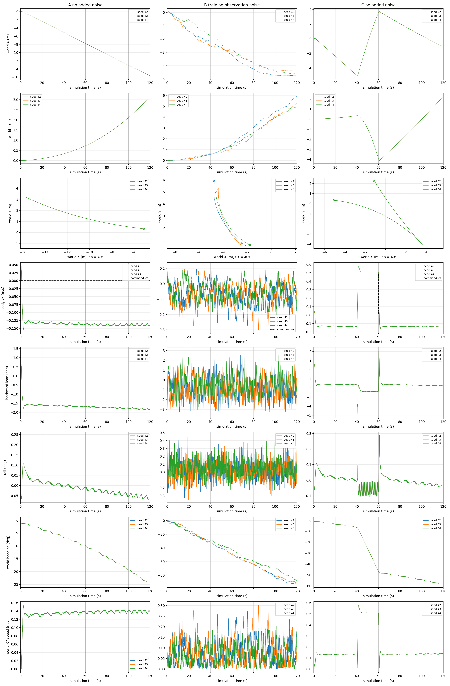

# Flat wheel DWAQ 零指令漂移诊断：20260912-172700-wheel-dwaq-drift

本批次在 LFR 的独立平地诊断入口运行 A/B/C × seeds 42、43、44，各 120 s，共 1080 s 仿真。9 次全部完成，无跌倒、异常终止或中途 reset。没有批准的验收阈值，本报告只给出测量事实，不给出“通过”或硬件可用结论。

**核心结果：无附加噪声也存在持续漂移。** A 的 40–120 s 净位移 10.992465 m，拟合漂移速度 13.7850 cm/s，平均机体 vx=-0.137949 m/s（向后）。B 三个 seed 同样漂移，但本次净位移、拟合速度及平均平面速度均低于 A；未复现 Isaac 参考中“仅加噪声才产生明显漂移”的关系。C 在停车后的最后两个 20 s 窗口仍持续移动。

## 身份、条件与采集边界

- 实际加载 ONNX：`/home/lfr/sim2sim_test/sim2sim_work/20260912-172700-wheel-dwaq-drift/policy/LW/robot_lab/wheel_loco/policy.onnx`。SHA-256：`f19ef4d568e3fc5b0cc4cf07d3f34519683e372b4bc3f296284af4823257015d`，与指定值完全一致。
- 归档：`/home/lfr/policy_storage/LW/wheel_loco/2026-09-11-17-04-10`；JIT SHA-256：`7fe006dade63ed6003321e37392834e490ef5e993ddc43dad64c72a5f5cb3ac3`，匹配但未用于闭环。训练 run `2026-09-11_17-04-10`，checkpoint `model_49999.pt`，任务 `RobotLab-Isaac-Velocity-Flat-LW-wheel-Dwaq-v0`；算法/runner 为归档声明的 DWAQPPO / OnPolicyRunnerDwaq。训练 checkpoint 字节本机未持有，其哈希仅作为归档声明。
- rl_sar HEAD：`536e94dab10eedb31971c8b741f8b915163aa353`。相关未提交差异、源码原字节及归档说明在 `config_snapshot/`；生产文件运行前后哈希与 Git 状态一致。policy_storage 更名提交 `1854e61` 在本机历史中。
- ONNX 实际接口 float32 `obs[1,195] -> actions[1,10]`。每帧 39 维，5 帧由旧到新排列；DWAQ 内部 actor 顺序为 `[encoded_velocity, encoded_latent, current_obs]`，已包含在模型中，不是外部拼接要求。训练说明声明归一化关闭，图结构也无归一化算子或对应参数，本程序不添加归一化。
- 实际 XML 在 `config_snapshot/src/rl_sar_zoo/LW_description/mjcf/scene.xml`：唯一地面为世界 z=0 的无限 plane，单位姿态，法向 +Z，坡度 0°，无台阶/heightfield；独立场景移除了原六个台阶，机器人模型未改。地面/碰撞默认摩擦 `[0.8,0.005,0.0001]`、condim=3、solref=`[0.02,1]`、solimp=`[0.9,0.95,0.001,0.5,2]`。完整编译后模型参数在 runtime_config.json。
- 无参数/初态随机化、推扰或外力；每个物理轨迹记录的 xfrc_applied/qfrc_applied 均为零。进入策略的传感器 noise 声明为零，全部 cutoff=0；另有10个扭矩传感器声明 noise=0.01，扭矩不是195维策略输入，本次保留该声明。无附加滤波或可配置量化；保留 float64 仿真到 float32 观测的精度转换。
- 初态完全沿用 home_wheel：base 原点 `[0,0,0.70]` m，body-to-world wxyz `[1,0,0,0]`，全部根部/关节 qvel=0、ctrl=0；策略顺序默认角 `[0,0,0.733,-0.733,-0.1745,0.1745,0,0,0,0]` rad。右/左轮碰撞网格初始最低点分别为 0.028328/0.028345 m；这是同一 MuJoCo 3.2.7 对初态的静态几何计算，不含接触 margin，没有推进仿真。
- 每用例独立进程；先物理 home_wheel reset，再正常 WheelLocomotion Enter/Activate 初始化控制器、上一动作和历史；没有额外姿态恢复等待。每次首帧复制填满 5 帧，之后每策略步移动一次。物理热键 reset 单独使用并不会重新激活控制器；本次不执行中途热键 reset，也不声称验证其历史行为。
- MuJoCo **3.2.7**，ONNX Runtime **1.22.0**，现有 CPU 后端。physics dt=0.002 s；policy=0.02 s；名义低层=0.005 s、decimation=4，沿用原诊断调度，实际低层间隔为 0.006/0.004 s 交替。新策略输出首次写入 ctrl 的实测延迟固定为 **0.006 s**；传感器状态通常来自前一物理步起点，实测年龄 0.002 s（初始为0）。未添加执行器延迟，仍保留以上调度延迟。未测试交互部署程序的异步线程墙钟抖动。
- 完整实际启动 argv/cwd 在 commands.json 和每个 process.json，编译命令、动态库路径/哈希在 tools/build_command.json、runtime_dependencies.json。模型加载有原部署验证/warmup，不计入闭环仿真预算。
- 停止条件：非有限输入/动作/状态、MuJoCo 警告、控制保护锁存、base z<0.25 m、直立轴总倾斜>75°、机身碰撞、程序异常；单次墙钟600 s，上层超时615 s。均未触发。总倾斜仅用于保护，不代替 pitch 指标。

## 观测与控制核对

| 帧索引 | 字段及坐标/单位 | 缩放 | B 加噪前幅度 |
|---|---|---|---|
| 0:3 | 机体角速度 rad/s | 0.25 | uniform ±0.2 |
| 3:6 | Rᵀ[0,0,-1]，机体系单位重力 | 1 | uniform ±0.05 |
| 6:9 | vx、vy m/s，wz rad/s | 1 | 无 |
| 9:19 | q-default_q，rad；轮位置按名字对应列屏蔽 | 1 | 非轮 ±0.01；轮为0 |
| 19:29 | 全部关节 dq，rad/s | 0.05 | uniform ±0.5 |
| 29:39 | 上一步模型动作经原动作 clip、未缩放 | 1 | 无 |

索引从0开始，最新帧位于156:195，轮位置绝对索引173、174。完整输入直接从模型调用的 TensorView 复制，非离线重建。四元数为 base_link 到世界的 wxyz，body +X 前向、+Z 向上；机身可视 mesh 的内部变换保留在 XML。原始 ZYX pitch=`asin(2*(qw*qy-qx*qz))`，本报告后仰正值=`degrees(asin(clamp(2*(qx*qz-qw*qy),-1,1)))`。roll 单独计算 `atan2(R[2,1],R[2,2])`，yaw 独立解缠。速度测量点为 freejoint/base 原点；世界速度为 qvel前三维，机体速度为 Rᵀv；COM速度另存，不混用。

| policy索引 | 关节 | MuJoCo joint ID | qpos地址 | qvel地址 |
|---|---|---|---|---|
|0|right_hip_joint|1|7|6|
|1|left_hip_joint|6|12|11|
|2|right_thigh_joint|2|8|7|
|3|left_thigh_joint|7|13|12|
|4|right_shank_joint|3|9|8|
|5|left_shank_joint|8|14|13|
|6|right_foot_joint|5|11|10|
|7|left_foot_joint|10|16|15|
|8|right_wheel_joint|4|10|9|
|9|left_wheel_joint|9|15|14|

关节/模型动作顺序相同，没有交换左右关节。前8个关节为位置目标，最后右/左轮为速度目标。动作先按各维 ±100 裁剪；`q_target=default_q+0.25*a`（前8关节），轮 q_target=default_q、`dq_target=a`；其余 dq_target=0。外部 PD 为 `tau=feedforward+Kp*(q_target-q)+Kd*(dq_target-dq)`，再限制到各关节扭矩上限写入 MuJoCo ctrl。执行器为直接力矩 motor，gear=1；另有 ctrlrange 限幅，无独立 forcelimited 动态环节。

| 关节组 | Kp | Kd | 力矩/ctrl上限 Nm |
|---|---:|---:|---:|
| 髋、大腿、小腿（6） |90|3|120|
| 脚（2） |36|1.8|27|
| 轮（2） |0|0.5|40|

关节名义 damping=0.01、armature=0.01、frictionloss=0.2；freejoint 为0。完整逐body质量、COM、主惯量及惯性轴四元数、关节范围和执行器编译值均保存在有效配置。base质量10.802295 kg，body COM=`[0.08622748,-0.00009382,-0.03217461]` m。

## 噪声证据与隔离

基础 rough_env_cfg.py 与归档哈希一致；训练时 flat_env_cfg.py 原字节及有效配置JSON未在本机找到，用户明确确认 flat 继承且不覆盖相关配置。以此确定本次训练噪声幅度和非轮位置选择规则，报告保留这一人工来源。操作顺序为观测项原值→选择性加噪→项裁剪±100→缩放→历史。该顺序也与捕获的 [IsaacLab官方观测管理器参考实现](https://raw.githubusercontent.com/isaac-sim/IsaacLab/main/source/isaaclab/isaaclab/managers/observation_manager.py) 一致；参考文件不能证明训练机安装版本，版本绑定仍缺失。

独立目录的 lw_runtime_core.hpp 仅在原观测构建与原历史插入之间添加钩子；生产原文件未改。A/C 帧逐值不变。B 每帧从该帧原始值加一次噪声，再进入原5帧历史；初始化复制同一首个带噪帧，后续旧帧不重新加噪。每个实测状态均验证无噪声训练裁剪路径与原部署输出完全相等，因此本次没有额外引入裁剪顺序差异。

噪声生成使用独立 std::mt19937(seed)，取输出高24位形成float32 uniform。每帧按gyro3、gravity3、position10、velocity10抽样；位置轮列抽样后丢弃以保持0。与Torch RNG不是同一条序列，不能将同 seed 解释为跨引擎逐噪声配对。原值、抽样、scale和最终帧逐步存储，独立Python复算全部 B 序列完全一致。A/C 没有可用随机源影响动力学，三seed的位姿/输入/动作逐值一致，属于同一确定性轨迹的重复执行，不构成三个不同初态样本。

## 测试与统计定义

A/B全程零指令，B仅开启上述噪声；C：0–40 s零指令，40–60 s `[0.5,0,0]`，60–120 s零指令。A和C前40 s位姿、输入、动作逐值一致。每用例6000策略记录、60000物理步、24000低层更新，全部终止原因 time_limit。

逐控制步前状态、动作、各物理子步和执行后状态分开保存。统计窗口状态采样为50 Hz，通常为[lo,hi)；位移及航向使用精确窗口端点（120 s取最后post状态）；位置拟合使用包括端点的原始位置，不平滑、不降采样。XY拟合斜率为分别对 x(t)、y(t)普通最小二乘，漂移速度是两斜率向量的模；最大距离相对窗口起点，活动范围=max-min。速度RMS/P95指世界XY速度模；均值vx同时报告机体系有符号值。累计路程为50 Hz位置差模之和，仅作补充。所有窗口均处于单个reset段；0秒含初始reset，后续无reset。完整精度及全部逐关节动作/扭矩指标见 statistics.json。

## 核心对比：40–120秒

|条件/seed|净位移 m|拟合速度 cm/s|平均XY速度 cm/s|平均机体vx m/s|航向变化 °|
|---|---:|---:|---:|---:|---:|
|A / 42、43、44（逐值相同）|10.992465|13.7850|13.8018|-0.137949|-18.160|
|B-seed42|5.947174|7.7562|8.5495|-0.078143|-59.738|
|B-seed43|4.960181|7.0290|7.5445|-0.064190|-60.355|
|B-seed44|5.229540|7.0069|7.6461|-0.067836|-58.767|

|seed|B−A净位移 m|B−A拟合速度 cm/s|B−A平均XY速度 cm/s|B−A航向变化 °|
|---|---:|---:|---:|---:|
|42|-5.045291|-6.0288|-5.2523|-41.578|
|43|-6.032284|-6.7560|-6.2573|-42.195|
|44|-5.762925|-6.7781|-6.1556|-40.607|

## 全窗口位置指标

A和C表格各合并三个逐值相同的seed；机器可读统计仍分别保留9次结果。全部窗口覆盖完整。

|用例|窗口 s|净Δ(x,y) m|净位移 m|拟合(vx,vy) m/s|拟合速度 m/s|距起点最大 m|x/y活动范围 m|累计路程 m|
|---|---|---|---:|---|---:|---:|---|---:|
|A-seed42|0–20|(-2.403685, 0.094989)|2.405561|(-0.128944, 0.004950)|0.129039|2.405561|(2.431107, 0.095345)|2.460983|
|A-seed42|20–40|(-2.662211, 0.236312)|2.672679|(-0.133174, 0.011713)|0.133688|2.672679|(2.662211, 0.236312)|2.673073|
|A-seed42|40–80|(-5.398601, 0.980871)|5.486985|(-0.134933, 0.024390)|0.137120|5.486985|(5.398601, 0.980871)|5.491503|
|A-seed42|80–120|(-5.222250, 1.853176)|5.541313|(-0.130798, 0.046211)|0.138722|5.541313|(5.222250, 1.853176)|5.549664|
|A-seed42|40–120|(-10.620851, 2.834047)|10.992465|(-0.133316, 0.035063)|0.137850|10.992465|(10.620851, 2.834047)|11.041166|
|B-seed42|0–20|(-1.392668, 0.244792)|1.414019|(-0.076674, 0.012874)|0.077747|1.414019|(1.409508, 0.252294)|1.564920|
|B-seed42|20–40|(-0.752822, 0.310635)|0.814392|(-0.035117, 0.015887)|0.038544|0.835331|(0.771296, 0.321409)|1.091507|
|B-seed42|40–80|(-2.110258, 2.481172)|3.257207|(-0.055991, 0.064738)|0.085592|3.257207|(2.113816, 2.481374)|3.592275|
|B-seed42|80–120|(-0.470894, 2.876676)|2.914963|(-0.009447, 0.064855)|0.065540|2.914963|(0.508079, 2.876676)|3.244760|
|B-seed42|40–120|(-2.581151, 5.357848)|5.947174|(-0.034814, 0.069310)|0.077562|5.947174|(2.621896, 5.358050)|6.837035|
|B-seed43|0–20|(-1.431561, 0.170697)|1.441702|(-0.077483, 0.008126)|0.077908|1.441702|(1.457008, 0.172175)|1.752313|
|B-seed43|20–40|(-1.094052, 0.478472)|1.194104|(-0.054996, 0.022653)|0.059478|1.194104|(1.094052, 0.478472)|1.595934|
|B-seed43|40–80|(-1.330024, 1.807422)|2.244045|(-0.034605, 0.043409)|0.055514|2.244045|(1.330024, 1.807422)|2.784063|
|B-seed43|80–120|(-0.527256, 2.791915)|2.841265|(-0.012475, 0.069931)|0.071035|2.841265|(0.536597, 2.791915)|3.247423|
|B-seed43|40–120|(-1.857281, 4.599337)|4.960181|(-0.028006, 0.064470)|0.070290|4.960181|(1.866621, 4.599337)|6.031487|
|B-seed44|0–20|(-0.524454, 0.035971)|0.525686|(-0.040517, 0.003759)|0.040691|0.703592|(0.765802, 0.082635)|1.190108|
|B-seed44|20–40|(-1.238662, 0.541335)|1.351786|(-0.061493, 0.027105)|0.067201|1.351786|(1.238662, 0.541335)|1.485157|
|B-seed44|40–80|(-2.018633, 1.996968)|2.839500|(-0.051162, 0.050546)|0.071920|2.839500|(2.018633, 1.996968)|3.182107|
|B-seed44|80–120|(-0.827817, 2.390036)|2.529339|(-0.021012, 0.061323)|0.064823|2.529339|(0.836735, 2.390036)|2.931485|
|B-seed44|40–120|(-2.846450, 4.387004)|5.229540|(-0.036994, 0.059508)|0.070069|5.229540|(2.855368, 4.387004)|6.113593|
|C-seed42|0–20|(-2.403685, 0.094989)|2.405561|(-0.128944, 0.004950)|0.129039|2.405561|(2.431107, 0.095345)|2.460983|
|C-seed42|20–40|(-2.662211, 0.236312)|2.672679|(-0.133174, 0.011713)|0.133688|2.672679|(2.662211, 0.236312)|2.673073|
|C-seed42|40–60|(8.642700, -4.301370)|9.653914|(0.451669, -0.218891)|0.501914|9.653914|(8.672493, 4.306188)|9.916540|
|C-seed42|60–80|(-1.520065, 1.774120)|2.336257|(-0.085731, 0.099557)|0.131382|2.336257|(1.666460, 1.929507)|2.764521|
|C-seed42|80–100|(-1.645886, 2.160622)|2.716106|(-0.082158, 0.107797)|0.135536|2.716106|(1.645886, 2.160622)|2.716621|
|C-seed42|100–120|(-1.509165, 2.288602)|2.741401|(-0.075397, 0.114382)|0.136996|2.741401|(1.509165, 2.288602)|2.742152|

## 全窗口速度与姿态

|用例|窗口 s|世界均速(vx,vy) m/s|机体平均vx m/s|XY速度均值/RMS/P95 m/s|Δyaw °|后仰角范围 °|roll范围 °|
|---|---|---|---:|---|---:|---|---|
|A-seed42|0–20|(-0.120112, 0.004752)|-0.120215|(0.122983, 0.126453, 0.138738)|-3.812|(-2.134, 1.392)|(-0.066, 0.246)|
|A-seed42|20–40|(-0.133114, 0.011810)|-0.133599|(0.133657, 0.133676, 0.136651)|-2.976|(-1.672, -1.568)|(-0.008, 0.021)|
|A-seed42|40–80|(-0.134969, 0.024517)|-0.137227|(0.137291, 0.137312, 0.140623)|-7.498|(-1.771, -1.616)|(-0.037, 0.005)|
|A-seed42|80–120|(-0.130561, 0.046322)|-0.138671|(0.138744, 0.138766, 0.141617)|-10.661|(-1.873, -1.691)|(-0.068, -0.024)|
|A-seed42|40–120|(-0.132765, 0.035419)|-0.137949|(0.138018, 0.138041, 0.141402)|-18.160|(-1.873, -1.616)|(-0.068, 0.005)|
|B-seed42|0–20|(-0.069624, 0.012236)|-0.070977|(0.078286, 0.093364, 0.170020)|-16.060|(-3.239, 2.372)|(-0.331, 0.410)|
|B-seed42|20–40|(-0.037669, 0.015534)|-0.040918|(0.054639, 0.066331, 0.129739)|-16.997|(-3.183, 1.339)|(-0.297, 0.467)|
|B-seed42|40–80|(-0.052731, 0.062018)|-0.082307|(0.089840, 0.106119, 0.199300)|-30.800|(-3.493, 2.516)|(-0.286, 0.359)|
|B-seed42|80–120|(-0.011797, 0.071903)|-0.073980|(0.081150, 0.095883, 0.176289)|-28.938|(-3.319, 2.405)|(-0.303, 0.342)|
|B-seed42|40–120|(-0.032264, 0.066961)|-0.078143|(0.085495, 0.101131, 0.185268)|-59.738|(-3.493, 2.516)|(-0.303, 0.359)|
|B-seed43|0–20|(-0.071557, 0.008534)|-0.072149|(0.087651, 0.100719, 0.165898)|-12.884|(-3.219, 3.000)|(-0.349, 0.392)|
|B-seed43|20–40|(-0.054690, 0.023892)|-0.059961|(0.079807, 0.098899, 0.190284)|-18.262|(-3.144, 1.687)|(-0.232, 0.344)|
|B-seed43|40–80|(-0.033259, 0.045170)|-0.056681|(0.069653, 0.085704, 0.159826)|-32.321|(-2.926, 2.187)|(-0.220, 0.377)|
|B-seed43|80–120|(-0.013195, 0.069797)|-0.071698|(0.081237, 0.099839, 0.194541)|-28.034|(-3.417, 2.683)|(-0.283, 0.419)|
|B-seed43|40–120|(-0.023227, 0.057484)|-0.064190|(0.075445, 0.093040, 0.175112)|-60.355|(-3.417, 2.683)|(-0.283, 0.419)|
|B-seed44|0–20|(-0.026185, 0.001788)|-0.026288|(0.059526, 0.069494, 0.131639)|-17.788|(-2.912, 2.338)|(-0.235, 0.444)|
|B-seed44|20–40|(-0.061931, 0.027060)|-0.067754|(0.074306, 0.088952, 0.164275)|-11.231|(-2.919, 1.466)|(-0.201, 0.437)|
|B-seed44|40–80|(-0.050484, 0.049909)|-0.071922|(0.079602, 0.093079, 0.164840)|-30.424|(-3.167, 2.788)|(-0.225, 0.445)|
|B-seed44|80–120|(-0.020700, 0.059733)|-0.063750|(0.073321, 0.089302, 0.169041)|-28.343|(-3.551, 2.494)|(-0.309, 0.397)|
|B-seed44|40–120|(-0.035592, 0.054821)|-0.067836|(0.076461, 0.091210, 0.166494)|-58.767|(-3.551, 2.788)|(-0.309, 0.445)|
|C-seed42|0–20|(-0.120112, 0.004752)|-0.120215|(0.122983, 0.126453, 0.138738)|-3.812|(-2.134, 1.392)|(-0.066, 0.246)|
|C-seed42|20–40|(-0.133114, 0.011810)|-0.133599|(0.133657, 0.133676, 0.136651)|-2.976|(-1.672, -1.568)|(-0.008, 0.021)|
|C-seed42|40–60|(0.431849, -0.214876)|0.492056|(0.495612, 0.502233, 0.550410)|-40.024|(-4.949, -1.641)|(-0.124, 0.103)|
|C-seed42|60–80|(-0.075760, 0.088452)|-0.116409|(0.138438, 0.145403, 0.163898)|-4.323|(-2.379, 2.112)|(-0.078, 0.288)|
|C-seed42|80–100|(-0.082299, 0.108029)|-0.135771|(0.135833, 0.135852, 0.138774)|-3.093|(-1.745, -1.627)|(-0.027, -0.000)|
|C-seed42|100–120|(-0.075463, 0.114431)|-0.137045|(0.137112, 0.137134, 0.140254)|-4.242|(-1.786, -1.664)|(-0.042, -0.013)|

## 分别回答诊断问题

1. **无附加噪声未形成有界站立。** A 的40–80 s与80–120 s净位移分别为5.4870、5.5413 m，拟合速度分别为13.712、13.872 cm/s。各后期20 s窗口仍有一致非零位置趋势，40秒不能称为已静止。小幅姿态/速度振荡叠加于持续位置迁移之上，不能用“往复平衡摆动”解释全部位移。
2. **本场景没有证据支持训练噪声使长期漂移增加。** B三个seed的净位移、拟合速度、平均平面速度均低于配对A；B也明显不静止。净位移下降部分伴随更大的航向改变，同时机体系向后平均速度和世界平均速度模也确实下降，因此不能仅用路径抵消解释全部差异，更不能把加噪声当作修复方案。噪声使瞬时速度和姿态波动增加，长期行为仍不满足静止描述。
3. **方向显示共同偏置，而非已证实的无偏随机游走。** A/B在40–120 s均为世界Δx<0、Δy>0，平均机体vx<0，航向变化均为负；B三seed的变化幅度不同但方向一致。这里只改变噪声种子、没有改变初始朝向或姿态，不能分辨偏置绑定于世界、机器人结构、控制参数还是策略，也不能把三个seed推广到所有场景。
4. **运动后零指令仍持续到测试末尾。** C运动段平均机体vx=0.492056 m/s，跟踪误差均值=-0.007944、RMSE=0.098906 m/s；但yaw指令为0时航向累计变化-40.024°，直行有转向偏差。停车60–80 s净位移2.336257 m，该窗口混合初始制动及后续向后运动。80–100、100–120 s仍分别移动2.716106、2.741401 m，平均机体vx=-0.135771、-0.137045 m/s。后续位置变化没有逐渐结束，不能将整段归为短暂制动；没有批准的阈值与保持时长，不宣告“停车完成”。
5. **接口/时序证据支持的范围。** 54000次实际输入为195维，轮位置屏蔽、历史移位/首帧填充、上一动作、指令、q/dq映射、动作目标和PD限幅计算均经独立复算核验。A/B只改变批准的每帧噪声；原始状态随闭环分化而变化是正常现象。无法由这些事实直接定位漂移根因。

## 与Isaac参考的条件差异及后续建议

Isaac参考为相同策略、seed42、平面、固定参数、零初速、无推扰/执行器延迟：无噪40–120 s净位移约0.00024 m，有噪约3.72 m、拟合约0.048 m/s。它不是验收线。本次无噪和有噪均与该现象关系不同，不能只比较最终数值便认定某个参数错误。

|项目|本次MuJoCo|可获得的Isaac证据|解释范围|
|---|---|---|---|
|脚关节Kp/Kd|36 / 1.8|归档匹配资产源码28 / 1.4|确认源码层配置差异；未取得该参考测试最终有效配置，不声称其必然实测值|
|摩擦|0.8（完整向量见配置）|归档对平面参考说明摩擦1|确认说明层条件不同，接触求解不可直接等同|
|初始base高度|0.700m；轮底约0.0283m|归档匹配资产默认0.725m；参考最终有效姿态未取得|本次完整保留部署初态，不能认定跨引擎初始落地过程相同|
|物理及低层执行|2ms；PD实际6/4ms交替；策略20ms；动作初次生效6ms后|参考称无执行器延迟，物理/PD实测时间记录未提供|“无附加延迟”不等于两端时序完全相同|
|噪声与随机数|幅度/通道按已确认继承配置；独立MT19937|训练噪声，Torch具体序列/运行时源码未取得|相同seed不构成逐随机数配对|
|质量/COM/惯量/接触求解|名义MJCF，完整编译值归档|完整参考运行编译值未提供|不能仅凭固定参数便宣称两端物理等价|

最有区分力的下一步（仅建议，未执行）：先取得Isaac参考的有效配置和初始状态/实际模型输入，做同一原始状态的跨端观测及动作核验；之后若另获批准，优先只改变脚PD至对应Isaac实测值做成对诊断，观察无噪漂移和转向是否同步变化。也可单独隔离控制/传感器调度延迟，或改变初始朝向区分世界偏置与机体偏置。不要一次同时改PD、摩擦、初态和时序；不建议凭本批次直接改奖励或部署参数。

## 验证、缺失项与交付

- 9/9完整结束，0跌倒/非有限/程序异常终止，9个初始reset、0中途reset；数据可读、时间连续、形状正确。零原始动作clip，全部记录物理力矩均未达到所设上限；完整逐关节振荡与饱和率在statistics.json。全程有效地面接触仅左右wheel_collision；初始约落地前的一小段无接触，原始接触点/力保留，未将转轮本身当作漂移证据。
- 采集器保留全部物理子步ctrl、actuator_force、qfrc_actuator、接触和状态；没有物理子步降采样。q/dq原始值、默认值、关节/执行器映射、噪声前后与完整195维输入均可追溯。
- 未获取：训练机有效配置JSON/YAML、修改后flat原字节、训练安装版IsaacLab管理器及Torch RNG序列；继承无覆盖由用户确认。未执行中途reset，未验证异步交互线程墙钟时序；未采集每步最低碰撞几何离地高度，初态最低mesh高度已补充，逐步site高度可用。此矩阵未要求视频，因此未录制。
- 分析首次使用默认Python因缺matplotlib退出，改用已安装系统Python；随后修复JSON对NumPy布尔值的序列化。相关日志保留，均发生在离线分析阶段，没有重跑或追加闭环用例，也没有安装依赖。
- 所有原始JSON数字按实际float32/float64可往返精度保存；表格只为阅读格式化。图中A/C三个seed逐值重合，B按颜色区分；完整曲线在下图。

报告：report.md；统计：statistics.json、comparison.json；输入/时序核验：input_validation.json、additional_audit.json、final_checks.json；实际配置：runtime_config.json；原始数据：cases/*/telemetry.jsonl.gz；命令：commands.json；源码及差异：tools/、config_snapshot/。manifest.json逐文件记录SHA-256，manifest.sha256校验清单本身。

使用技能原有sim2sim_report_bundle.py生成独立完整tar.gz；接收方younghit尚未确认资源哈希，全部实际模型mesh/texture资源均随包提供，不使用缓存省略。压缩包不包含策略权重或依赖环境；模型身份由完整哈希绑定。本机原始目录保留。本次没有Git提交/推送，没有远端传输或接收端验证。
